<!-- DYNAMIC BANNER -->
<div align="center">
  
</div>

<!-- ⚡ MOVING TYPEWRITER WIDGET -->
<div align="center">
  
</div>

<!-- 🟢 FREELANCE AVAILABILITY BADGE -->
<div align="center">

<svg xmlns="http://www.w3.org/2000/svg" viewBox="0 0 520 54" width="520">
  <defs>
    <linearGradient id="avbg" x1="0%" y1="0%" x2="100%" y2="0%">
      <stop offset="0%" stop-color="#0a1628"/>
      <stop offset="100%" stop-color="#0d1f3c"/>
    </linearGradient>
    <filter id="avGlow"><feGaussianBlur stdDeviation="2.5" result="b"/><feMerge><feMergeNode in="b"/><feMergeNode in="SourceGraphic"/></feMerge></filter>
  </defs>
  <rect width="520" height="54" rx="10" fill="url(#avbg)" stroke="#1a4a2e" stroke-width="1.5"/>
  <rect width="520" height="54" rx="10" fill="none" stroke="#22c55e" stroke-width="1">
    <animate attributeName="opacity" values="0.3;0.8;0.3" dur="3s" repeatCount="indefinite"/>
  </rect>
  <!-- Pulsing dot -->
  <circle cx="28" cy="27" r="7" fill="#22c55e" filter="url(#avGlow)">
    <animate attributeName="r" values="6;9;6" dur="1.5s" repeatCount="indefinite"/>
    <animate attributeName="opacity" values="0.7;1;0.7" dur="1.5s" repeatCount="indefinite"/>
  </circle>
  <circle cx="28" cy="27" r="3.5" fill="#ffffff"/>
  <!-- Status text -->
  <text x="48" y="20" font-family="'Courier New',Courier,monospace" font-size="10" fill="#22c55e" font-weight="bold" letter-spacing="2">AVAILABILITY STATUS</text>
  <text x="48" y="38" font-family="Arial,sans-serif" font-size="14" fill="#f1f5f9" font-weight="700">🟢 Open for Freelance &amp; Bot Dev Projects</text>
  <!-- Right tag -->
  <rect x="380" y="14" width="126" height="26" rx="6" fill="#14532d" stroke="#22c55e" stroke-width="1"/>
  <text x="443" y="32" font-family="'Courier New',Courier,monospace" font-size="10" fill="#4ade80" text-anchor="middle" font-weight="bold">DM TO COLLABORATE</text>
</svg>

</div>

<!-- 📊 DYNAMIC LIVE COUNTERS & BADGES -->
<div align="center">
  
  &nbsp;&nbsp;
  
  &nbsp;&nbsp;
  
  &nbsp;&nbsp;
  <a href="https://discord.com">
    
  </a>
  &nbsp;&nbsp;
  <a href="https://github.com/dmzrider">
    
  </a>
</div>

<br/>

---

### 👾 About Me

<table>
<tr>
<td width="55%" valign="top">

**`> whoami`**

```yaml
Name        : Manu
Handle      : dmzrider / echo__dev
Location    : Kerala, India 🌏
Status      : Building 24/7 🚀
```

**`> cat roles.txt`**

```diff
+ Discord Bot Developer
+ SA-MP Pawn Scripter
+ Systems Security Engineer
+ Freelance Startup Developer
```

</td>
<td width="45%" valign="top">

**`> cat skills.sh`**

```bash
#!/bin/bash
# Current Focus Areas

echo "🤖 Bot Automation & Pipelines"
echo "🎮 SA-MP Pawn Custom Gamemodes"
echo "🛡️ DDoS Detection & Alert Systems"
echo "📡 High-Frequency Network Tickers"
echo "🏗️ Startup API & Dashboard Tools"
```

</td>
</tr>
</table>


<!-- 🏗️ CURRENTLY BUILDING -->

---

### 🏗️ Currently Building

<div align="center">

<svg xmlns="http://www.w3.org/2000/svg" viewBox="0 0 860 110" width="100%">
  <defs>
    <linearGradient id="cbbg" x1="0%" y1="0%" x2="100%" y2="100%">
      <stop offset="0%" stop-color="#060c1a"/>
      <stop offset="100%" stop-color="#0c0e22"/>
    </linearGradient>
    <filter id="cbGlow"><feGaussianBlur stdDeviation="3" result="b"/><feMerge><feMergeNode in="b"/><feMergeNode in="SourceGraphic"/></feMerge></filter>
  </defs>
  <rect width="860" height="110" rx="12" fill="url(#cbbg)" stroke="#1e2d52" stroke-width="1.2"/>
  <rect width="860" height="110" rx="12" fill="none" stroke="#fbbf24" stroke-width="1">
    <animate attributeName="opacity" values="0.2;0.6;0.2" dur="4s" repeatCount="indefinite"/>
  </rect>
  <!-- Terminal bar -->
  <rect x="0" y="0" width="860" height="28" rx="12" fill="#0b1526"/>
  <rect x="0" y="14" width="860" height="14" fill="#0b1526"/>
  <circle cx="20" cy="14" r="4.5" fill="#ff5f57"/>
  <circle cx="36" cy="14" r="4.5" fill="#febc2e"/>
  <circle cx="52" cy="14" r="4.5" fill="#28c840"/>
  <text x="430" y="19" text-anchor="middle" font-family="'Courier New',Courier,monospace" font-size="9" fill="#64748b">build.log — dmzrider</text>
  <!-- Blinking build indicator -->
  <circle cx="820" cy="14" r="5" fill="#fbbf24" filter="url(#cbGlow)">
    <animate attributeName="opacity" values="1;0.2;1" dur="1s" repeatCount="indefinite"/>
  </circle>
  <text x="830" y="19" font-family="'Courier New',Courier,monospace" font-size="8" fill="#fbbf24">LIVE</text>
  <!-- Content -->
  <text x="24" y="52" font-family="'Courier New',Courier,monospace" font-size="11">
    <tspan fill="#6366f1">$</tspan>
    <tspan fill="#94a3b8"> git log --oneline --current</tspan>
  </text>
  <text x="24" y="72" font-family="'Courier New',Courier,monospace" font-size="12">
    <tspan fill="#fbbf24" font-weight="bold">▶</tspan>
    <tspan fill="#f1f5f9" dx="6">Discord Security Bot v2.0</tspan>
    <tspan fill="#64748b" dx="8">— Advanced moderation + DDoS alert hooks</tspan>
  </text>
  <text x="24" y="92" font-family="'Courier New',Courier,monospace" font-size="12">
    <tspan fill="#22c55e" font-weight="bold">▶</tspan>
    <tspan fill="#f1f5f9" dx="6">SA-MP Roleplay Gamemode v3</tspan>
    <tspan fill="#64748b" dx="8">— Tick-optimized MySQL threaded economy system</tspan>
  </text>
  <!-- ETA badge -->
  <rect x="730" y="56" width="110" height="22" rx="6" fill="#1e1b4b" stroke="#6366f1" stroke-width="1"/>
  <text x="785" y="72" text-anchor="middle" font-family="'Courier New',Courier,monospace" font-size="9" fill="#a5b4fc" font-weight="bold">ETA: THIS WEEK 🚀</text>
</svg>

</div>

---

### 🏆 Achievements & Milestones

<p align="center">
  <a href="https://github.com/dmzrider">
    
  </a>
  &nbsp;&nbsp;
  <a href="https://github.com/dmzrider">
    
  </a>
  &nbsp;&nbsp;
  <a href="https://github.com/dmzrider">
    
  </a>
</p>

---

### 💻 Skill Matrix & Tech Stack

<div align="center">
  <table border="0">
    <tr>
      <td align="center" width="180"><b>Category</b></td>
      <td align="center" width="280"><b>Tech Stack &amp; Core Tools</b></td>
      <td align="center" width="340"><b>Core Focus &amp; Specialty</b></td>
    </tr>
    <tr>
      <td><b>🤖 Automation &amp; Bots</b></td>
      <td>
        
      </td>
      <td>Custom Discord bots, permission workflows, webhook piping, interactive buttons &amp; modals.</td>
    </tr>
    <tr>
      <td><b>🎮 Game Development</b></td>
      <td>
        
      </td>
      <td>Custom game server scripting, MySQL query optimization, tick-based systems, and performance tuning.</td>
    </tr>
    <tr>
      <td><b>🗄️ Database &amp; Systems</b></td>
      <td>
        
      </td>
      <td>Database normalization, secure pipeline configs, localized hosting setups, and containerization.</td>
    </tr>
    <tr>
      <td><b>🛡️ Cloud &amp; Security</b></td>
      <td>
        
      </td>
      <td>Network traffic shielding, DDoS alert automation via bash script triggers, version control, and IDE workflows.</td>
    </tr>
  </table>
</div>

---

### 📌 Pinned Project Showcase

<div align="center">

<svg xmlns="http://www.w3.org/2000/svg" viewBox="0 0 860 210" width="100%">
  <defs>
    <linearGradient id="pjbg" x1="0%" y1="0%" x2="100%" y2="100%"><stop offset="0%" stop-color="#060c1a"/><stop offset="100%" stop-color="#0a0f20"/></linearGradient>
    <linearGradient id="card1g" x1="0%" y1="0%" x2="0%" y2="100%"><stop offset="0%" stop-color="#0f172a"/><stop offset="100%" stop-color="#0a0f1e"/></linearGradient>
    <filter id="pjGlow"><feGaussianBlur stdDeviation="3" result="b"/><feMerge><feMergeNode in="b"/><feMergeNode in="SourceGraphic"/></feMerge></filter>
  </defs>
  <rect width="860" height="210" rx="13" fill="url(#pjbg)" stroke="#1e2d52" stroke-width="1"/>
  <text x="430" y="28" text-anchor="middle" font-family="'Courier New',Courier,monospace" font-size="11" font-weight="bold" fill="#00f0ff" letter-spacing="3" opacity="0.85">// PROJECTS</text>

  <!-- Card 1: Discord Bot -->
  <rect x="16" y="42" width="262" height="152" rx="10" fill="url(#card1g)" stroke="#00f0ff" stroke-width="1.2"/>
  <rect x="16" y="42" width="262" height="152" rx="10" fill="none" stroke="#00f0ff" stroke-width="1">
    <animate attributeName="opacity" values="0.4;0.9;0.4" dur="3s" repeatCount="indefinite"/>
  </rect>
  <text x="30" y="68" font-family="Arial,sans-serif" font-size="18">🤖</text>
  <text x="58" y="68" font-family="'Courier New',Courier,monospace" font-size="12" font-weight="bold" fill="#00f0ff">discord-security-bot</text>
  <line x1="30" y1="78" x2="262" y2="78" stroke="#1e3a5f" stroke-width="1"/>
  <text x="30" y="100" font-family="Arial,sans-serif" font-size="11" fill="#94a3b8">Advanced Discord bot with DDoS</text>
  <text x="30" y="116" font-family="Arial,sans-serif" font-size="11" fill="#94a3b8">alert hooks, moderation engine</text>
  <text x="30" y="132" font-family="Arial,sans-serif" font-size="11" fill="#94a3b8">and webhook pipeline support.</text>
  <rect x="30" y="148" width="60" height="18" rx="4" fill="#1c3a1c"/>
  <text x="60" y="161" text-anchor="middle" font-family="'Courier New',Courier,monospace" font-size="9" fill="#4ade80">JavaScript</text>
  <text x="108" y="162" font-family="'Courier New',Courier,monospace" font-size="10" fill="#64748b">⭐ Private</text>
  <rect x="30" y="172" width="90" height="16" rx="4" fill="#0c1a2e" stroke="#00f0ff" stroke-width="0.8"/>
  <text x="75" y="183" text-anchor="middle" font-family="'Courier New',Courier,monospace" font-size="8" fill="#00f0ff">In Development</text>

  <!-- Card 2: SA-MP -->
  <rect x="299" y="42" width="262" height="152" rx="10" fill="url(#card1g)" stroke="#a855f7" stroke-width="1.2"/>
  <rect x="299" y="42" width="262" height="152" rx="10" fill="none" stroke="#a855f7" stroke-width="1">
    <animate attributeName="opacity" values="0.4;0.9;0.4" dur="4s" repeatCount="indefinite"/>
  </rect>
  <text x="313" y="68" font-family="Arial,sans-serif" font-size="18">🎮</text>
  <text x="341" y="68" font-family="'Courier New',Courier,monospace" font-size="12" font-weight="bold" fill="#a855f7">samp-rp-gamemode</text>
  <line x1="313" y1="78" x2="545" y2="78" stroke="#2d1b4e" stroke-width="1"/>
  <text x="313" y="100" font-family="Arial,sans-serif" font-size="11" fill="#94a3b8">Full SA-MP Roleplay gamemode</text>
  <text x="313" y="116" font-family="Arial,sans-serif" font-size="11" fill="#94a3b8">with MySQL threading, economy</text>
  <text x="313" y="132" font-family="Arial,sans-serif" font-size="11" fill="#94a3b8">system and y_less libraries.</text>
  <rect x="313" y="148" width="50" height="18" rx="4" fill="#2d1a00"/>
  <text x="338" y="161" text-anchor="middle" font-family="'Courier New',Courier,monospace" font-size="9" fill="#fb923c">Pawn</text>
  <text x="378" y="162" font-family="'Courier New',Courier,monospace" font-size="10" fill="#64748b">⭐ Private</text>
  <rect x="313" y="172" width="90" height="16" rx="4" fill="#1a0e2e" stroke="#a855f7" stroke-width="0.8"/>
  <text x="358" y="183" text-anchor="middle" font-family="'Courier New',Courier,monospace" font-size="8" fill="#a855f7">In Development</text>

  <!-- Card 3: DDoS Alert -->
  <rect x="582" y="42" width="262" height="152" rx="10" fill="url(#card1g)" stroke="#ff007f" stroke-width="1.2"/>
  <rect x="582" y="42" width="262" height="152" rx="10" fill="none" stroke="#ff007f" stroke-width="1">
    <animate attributeName="opacity" values="0.4;0.9;0.4" dur="5s" repeatCount="indefinite"/>
  </rect>
  <text x="596" y="68" font-family="Arial,sans-serif" font-size="18">🛡️</text>
  <text x="624" y="68" font-family="'Courier New',Courier,monospace" font-size="12" font-weight="bold" fill="#ff007f">ddos-alert-system</text>
  <line x1="596" y1="78" x2="828" y2="78" stroke="#3b0a1f" stroke-width="1"/>
  <text x="596" y="100" font-family="Arial,sans-serif" font-size="11" fill="#94a3b8">Bash + Discord webhook alerts</text>
  <text x="596" y="116" font-family="Arial,sans-serif" font-size="11" fill="#94a3b8">for real-time DDoS detection,</text>
  <text x="596" y="132" font-family="Arial,sans-serif" font-size="11" fill="#94a3b8">log analysis and port shielding.</text>
  <rect x="596" y="148" width="40" height="18" rx="4" fill="#1c1a0a"/>
  <text x="616" y="161" text-anchor="middle" font-family="'Courier New',Courier,monospace" font-size="9" fill="#facc15">Bash</text>
  <text x="650" y="162" font-family="'Courier New',Courier,monospace" font-size="10" fill="#64748b">⭐ Private</text>
  <rect x="596" y="172" width="90" height="16" rx="4" fill="#1f0a16" stroke="#ff007f" stroke-width="0.8"/>
  <text x="641" y="183" text-anchor="middle" font-family="'Courier New',Courier,monospace" font-size="8" fill="#ff007f">In Development</text>
</svg>

</div>

> 💡 *All projects are currently in private repos — public releases coming soon!*

---

### 📊 GitHub Analytics & Diagnostics

<div align="center">
  <table border="0">
    <tr>
      <td align="center" valign="top">
        
      </td>
      <td align="center" valign="top">
        
      </td>
    </tr>
  </table>
</div>

<br/>

<!-- ⚡ WAKATIME CODING STATS (Self-Contained Premium SVG) -->
<div align="center">

<svg xmlns="http://www.w3.org/2000/svg" viewBox="0 0 495 195" width="495">
  <defs>
    <linearGradient id="wkbg" x1="0%" y1="0%" x2="100%" y2="100%">
      <stop offset="0%" stop-color="#070a13"/>
      <stop offset="100%" stop-color="#0d1117"/>
    </linearGradient>
    <linearGradient id="barJS" x1="0%" y1="0%" x2="100%" y2="0%">
      <stop offset="0%" stop-color="#f7df1e"/><stop offset="100%" stop-color="#f1e05a"/>
    </linearGradient>
    <linearGradient id="barPawn" x1="0%" y1="0%" x2="100%" y2="0%">
      <stop offset="0%" stop-color="#3b82f6"/><stop offset="100%" stop-color="#60a5fa"/>
    </linearGradient>
    <linearGradient id="barSQL" x1="0%" y1="0%" x2="100%" y2="0%">
      <stop offset="0%" stop-color="#00758f"/><stop offset="100%" stop-color="#00a3cc"/>
    </linearGradient>
    <linearGradient id="barBash" x1="0%" y1="0%" x2="100%" y2="0%">
      <stop offset="0%" stop-color="#4eaa25"/><stop offset="100%" stop-color="#6ee7b7"/>
    </linearGradient>
    <filter id="wkGlow"><feGaussianBlur stdDeviation="2" result="b"/><feMerge><feMergeNode in="b"/><feMergeNode in="SourceGraphic"/></feMerge></filter>
  </defs>
  <rect width="495" height="195" rx="10" fill="url(#wkbg)" stroke="#1a233a" stroke-width="1.2"/>
  <rect width="495" height="195" rx="10" fill="none" stroke="#a855f7" stroke-width="1.2" opacity="0.3">
    <animate attributeName="opacity" values="0.2;0.6;0.2" dur="3s" repeatCount="indefinite"/>
  </rect>

  <!-- Title -->
  <text x="30" y="32" font-family="'Courier New',Courier,monospace" font-size="12" font-weight="bold" fill="#a855f7" letter-spacing="1">⚡ WEEKLY CODING STATS</text>
  <text x="465" y="31" font-family="'Courier New',Courier,monospace" font-size="9" fill="#64748b" text-anchor="end">Active: ~28 hrs/wk</text>

  <!-- JS -->
  <g transform="translate(30, 48)">
    <text x="0" y="12" font-family="Arial,sans-serif" font-size="11" font-weight="bold" fill="#e2e8f0">JavaScript</text>
    <text x="100" y="12" font-family="'Courier New',Courier,monospace" font-size="10" fill="#f7df1e">12h 36m</text>
    <rect x="160" y="3" width="220" height="9" rx="4.5" fill="#161b22"/>
    <rect x="160" y="3" width="0" height="9" rx="4.5" fill="url(#barJS)">
      <animate attributeName="width" values="0;99;99" dur="1.5s" fill="freeze" begin="0.2s"/>
    </rect>
    <text x="390" y="11" font-family="'Courier New',Courier,monospace" font-size="10" fill="#f7df1e">45%</text>
  </g>

  <!-- Pawn -->
  <g transform="translate(30, 76)">
    <text x="0" y="12" font-family="Arial,sans-serif" font-size="11" font-weight="bold" fill="#e2e8f0">Pawn (SA-MP)</text>
    <text x="100" y="12" font-family="'Courier New',Courier,monospace" font-size="10" fill="#3b82f6">8h 57m</text>
    <rect x="160" y="3" width="220" height="9" rx="4.5" fill="#161b22"/>
    <rect x="160" y="3" width="0" height="9" rx="4.5" fill="url(#barPawn)">
      <animate attributeName="width" values="0;70;70" dur="1.5s" fill="freeze" begin="0.4s"/>
    </rect>
    <text x="390" y="11" font-family="'Courier New',Courier,monospace" font-size="10" fill="#3b82f6">32%</text>
  </g>

  <!-- SQL -->
  <g transform="translate(30, 104)">
    <text x="0" y="12" font-family="Arial,sans-serif" font-size="11" font-weight="bold" fill="#e2e8f0">SQL/MySQL</text>
    <text x="100" y="12" font-family="'Courier New',Courier,monospace" font-size="10" fill="#00a3cc">3h 21m</text>
    <rect x="160" y="3" width="220" height="9" rx="4.5" fill="#161b22"/>
    <rect x="160" y="3" width="0" height="9" rx="4.5" fill="url(#barSQL)">
      <animate attributeName="width" values="0;26;26" dur="1.5s" fill="freeze" begin="0.6s"/>
    </rect>
    <text x="390" y="11" font-family="'Courier New',Courier,monospace" font-size="10" fill="#00a3cc">12%</text>
  </g>

  <!-- Bash -->
  <g transform="translate(30, 132)">
    <text x="0" y="12" font-family="Arial,sans-serif" font-size="11" font-weight="bold" fill="#e2e8f0">Bash Shell</text>
    <text x="100" y="12" font-family="'Courier New',Courier,monospace" font-size="10" fill="#4eaa25">1h 57m</text>
    <rect x="160" y="3" width="220" height="9" rx="4.5" fill="#161b22"/>
    <rect x="160" y="3" width="0" height="9" rx="4.5" fill="url(#barBash)">
      <animate attributeName="width" values="0;15;15" dur="1.5s" fill="freeze" begin="0.8s"/>
    </rect>
    <text x="390" y="11" font-family="'Courier New',Courier,monospace" font-size="10" fill="#4eaa25">7%</text>
  </g>

  <!-- Other -->
  <g transform="translate(30, 160)">
    <text x="0" y="12" font-family="Arial,sans-serif" font-size="11" font-weight="bold" fill="#e2e8f0">Other</text>
    <text x="100" y="12" font-family="'Courier New',Courier,monospace" font-size="10" fill="#64748b">1h 07m</text>
    <rect x="160" y="3" width="220" height="9" rx="4.5" fill="#161b22"/>
    <rect x="160" y="3" width="0" height="9" rx="4.5" fill="#64748b">
      <animate attributeName="width" values="0;8;8" dur="1.5s" fill="freeze" begin="1.0s"/>
    </rect>
    <text x="390" y="11" font-family="'Courier New',Courier,monospace" font-size="10" fill="#64748b">4%</text>
  </g>
</svg>

</div>


<br/>

<div align="center">
  
</div>

<br/>

<div align="center">
  
</div>

<br/>

---

### 📡 Contribution Activity Overview

<div align="center">
  
</div>

<br/>

<div align="center">
  
</div>


---

<!-- 🐍 ARCADE SNAKE CONTRIBUTION GAME (Updated every 12 hours) -->
<div align="center">
  <h4>🎮 Contribution Arcade Snake Game</h4>
  
</div>


<br/>

---

### 💡 Quote of the Day
<div align="center">
  
</div>

<br/>

<!-- 😂 RANDOM DEV JOKE -->
<div align="center">
  
</div>

<br/>

---

### 🌍 Global Reach

<div align="center">

<svg xmlns="http://www.w3.org/2000/svg" viewBox="0 0 860 220" width="100%">
  <defs>
    <linearGradient id="globebg" x1="0%" y1="0%" x2="100%" y2="100%"><stop offset="0%" stop-color="#04060f"/><stop offset="100%" stop-color="#080d1c"/></linearGradient>
    <radialGradient id="glowCenter" cx="50%" cy="50%" r="50%"><stop offset="0%" stop-color="#00f0ff" stop-opacity="0.08"/><stop offset="100%" stop-color="#00f0ff" stop-opacity="0"/></radialGradient>
    <filter id="dotGlow"><feGaussianBlur stdDeviation="2.5" result="b"/><feMerge><feMergeNode in="b"/><feMergeNode in="SourceGraphic"/></feMerge></filter>
    <filter id="bigGlobe"><feGaussianBlur stdDeviation="8" result="b"/><feMerge><feMergeNode in="b"/><feMergeNode in="SourceGraphic"/></feMerge></filter>
  </defs>
  <rect width="860" height="220" rx="13" fill="url(#globebg)" stroke="#1e2d52" stroke-width="1"/>
  <rect width="860" height="220" rx="13" fill="none" stroke="#4f46e5" stroke-width="1">
    <animate attributeName="opacity" values="0.2;0.5;0.2" dur="4s" repeatCount="indefinite"/>
  </rect>
  <!-- Title -->
  <text x="430" y="28" text-anchor="middle" font-family="'Courier New',Courier,monospace" font-size="11" font-weight="bold" fill="#00f0ff" letter-spacing="3" opacity="0.85">// GLOBAL_REACH</text>
  <!-- Globe circle -->
  <circle cx="430" cy="125" r="82" fill="none" stroke="#1e3a5f" stroke-width="1" opacity="0.6"/>
  <circle cx="430" cy="125" r="82" fill="url(#glowCenter)"/>
  <!-- Latitude lines -->
  <ellipse cx="430" cy="125" rx="82" ry="20" fill="none" stroke="#1e3a5f" stroke-width="0.7" opacity="0.5"/>
  <ellipse cx="430" cy="95" rx="70" ry="17" fill="none" stroke="#1e3a5f" stroke-width="0.5" opacity="0.4"/>
  <ellipse cx="430" cy="155" rx="70" ry="17" fill="none" stroke="#1e3a5f" stroke-width="0.5" opacity="0.4"/>
  <!-- Vertical line -->
  <line x1="430" y1="43" x2="430" y2="207" stroke="#1e3a5f" stroke-width="0.7" opacity="0.5"/>
  <line x1="348" y1="125" x2="512" y2="125" stroke="#1e3a5f" stroke-width="0.7" opacity="0.5"/>
  <!-- Connection lines to dots -->
  <line x1="430" y1="125" x2="178" y2="125" stroke="#00f0ff" stroke-width="0.6" stroke-dasharray="3 3" opacity="0.3"/>
  <line x1="430" y1="125" x2="310" y2="78" stroke="#a855f7" stroke-width="0.6" stroke-dasharray="3 3" opacity="0.3"/>
  <line x1="430" y1="125" x2="580" y2="90" stroke="#ff007f" stroke-width="0.6" stroke-dasharray="3 3" opacity="0.3"/>
  <line x1="430" y1="125" x2="720" y2="108" stroke="#fbbf24" stroke-width="0.6" stroke-dasharray="3 3" opacity="0.3"/>
  <line x1="430" y1="125" x2="520" y2="165" stroke="#22c55e" stroke-width="0.6" stroke-dasharray="3 3" opacity="0.3"/>
  <!-- Location dots with labels -->
  <!-- India (home) -->
  <circle cx="430" cy="125" r="8" fill="#00f0ff" filter="url(#dotGlow)">
    <animate attributeName="r" values="7;11;7" dur="2s" repeatCount="indefinite"/>
    <animate attributeName="opacity" values="0.8;1;0.8" dur="2s" repeatCount="indefinite"/>
  </circle>
  <circle cx="430" cy="125" r="3" fill="#ffffff"/>
  <text x="430" y="148" text-anchor="middle" font-family="'Courier New',Courier,monospace" font-size="8" fill="#00f0ff">🏠 Kerala, India</text>
  <!-- USA -->
  <circle cx="178" cy="125" r="5" fill="#a855f7" filter="url(#dotGlow)">
    <animate attributeName="opacity" values="0.5;1;0.5" dur="3s" repeatCount="indefinite"/>
  </circle>
  <text x="178" y="143" text-anchor="middle" font-family="'Courier New',Courier,monospace" font-size="8" fill="#a855f7">USA</text>
  <!-- Europe -->
  <circle cx="310" cy="78" r="5" fill="#ff007f" filter="url(#dotGlow)">
    <animate attributeName="opacity" values="0.5;1;0.5" dur="2.5s" repeatCount="indefinite"/>
  </circle>
  <text x="310" y="70" text-anchor="middle" font-family="'Courier New',Courier,monospace" font-size="8" fill="#ff007f">Europe</text>
  <!-- SE Asia -->
  <circle cx="580" cy="90" r="5" fill="#fbbf24" filter="url(#dotGlow)">
    <animate attributeName="opacity" values="0.5;1;0.5" dur="3.5s" repeatCount="indefinite"/>
  </circle>
  <text x="580" y="82" text-anchor="middle" font-family="'Courier New',Courier,monospace" font-size="8" fill="#fbbf24">SE Asia</text>
  <!-- Middle East -->
  <circle cx="520" cy="165" r="5" fill="#22c55e" filter="url(#dotGlow)">
    <animate attributeName="opacity" values="0.5;1;0.5" dur="4s" repeatCount="indefinite"/>
  </circle>
  <text x="520" y="182" text-anchor="middle" font-family="'Courier New',Courier,monospace" font-size="8" fill="#22c55e">Middle East</text>
  <!-- Australia -->
  <circle cx="720" cy="108" r="5" fill="#38bdf8" filter="url(#dotGlow)">
    <animate attributeName="opacity" values="0.5;1;0.5" dur="2.8s" repeatCount="indefinite"/>
  </circle>
  <text x="720" y="100" text-anchor="middle" font-family="'Courier New',Courier,monospace" font-size="8" fill="#38bdf8">Australia</text>
  <!-- Stats row -->
  <text x="90" y="200" text-anchor="middle" font-family="'Courier New',Courier,monospace" font-size="10" fill="#64748b">Profile Visitors</text>
  <text x="90" y="214" text-anchor="middle" font-family="'Courier New',Courier,monospace" font-size="13" fill="#00f0ff" font-weight="bold">🌐 Global</text>
  <text x="270" y="200" text-anchor="middle" font-family="'Courier New',Courier,monospace" font-size="10" fill="#64748b">Regions Reached</text>
  <text x="270" y="214" text-anchor="middle" font-family="'Courier New',Courier,monospace" font-size="13" fill="#a855f7" font-weight="bold">6+ Regions</text>
  <text x="590" y="200" text-anchor="middle" font-family="'Courier New',Courier,monospace" font-size="10" fill="#64748b">Based In</text>
  <text x="590" y="214" text-anchor="middle" font-family="'Courier New',Courier,monospace" font-size="13" fill="#fbbf24" font-weight="bold">🇮🇳 Kerala, India</text>
  <text x="770" y="200" text-anchor="middle" font-family="'Courier New',Courier,monospace" font-size="10" fill="#64748b">Availability</text>
  <text x="770" y="214" text-anchor="middle" font-family="'Courier New',Courier,monospace" font-size="13" fill="#22c55e" font-weight="bold">🟢 Open</text>
</svg>

</div>

---

### 🛠️ Specialties & Focus Areas

<details>
<summary><b>🤖 Discord Bot Development</b></summary>
<br/>

- **Interactive Architecture**: Building buttons, slash commands, select menus, and modals using discord.js / discord.py.
- **Synchronization**: Multi-guild role mirroring, sync pipelines, database integration, and OAuth2 setups.
- **Security Audits**: Automated detection of server threats, antispam configurations, and rate-limiting handles.
</details>

<details>
<summary><b>🎮 SA-MP Pawn Scripting</b></summary>
<br/>

- **Custom Gamemodes**: Modular script designs (y_less libraries like y_commands, y_inline), inventory systems, and business systems.
- **Optimized Queries**: Threaded database processing to eliminate server lag.
- **Low-level Tuning**: Code execution optimization for low tick-rate environments.
</details>

<details>
<summary><b>🛡️ Security & DDoS Alerts</b></summary>
<br/>

- **Log Analysis**: Shell hooks that monitor web-server and game-server ingress spikes.
- **Alert Hooks**: Integration with Discord webhooks to broadcast critical DDoS alarms/metrics in real time.
- **Port Shielding**: Custom Cloudflare proxying and local packet filters.
</details>

<details>
<summary><b>💼 Startup Freelancing</b></summary>
<br/>

- **Custom APIs**: Developing lightweight microservices using Express or Fastify.
- **Operations Dashboard**: Tailored scripts that display vital server metrics, user counts, and system runtimes.
</details>

---

### 📬 Connect With Me

<div align="center">

<svg xmlns="http://www.w3.org/2000/svg" viewBox="0 0 860 130" width="100%">
  <defs>
    <linearGradient id="connbg" x1="0%" y1="0%" x2="100%" y2="100%">
      <stop offset="0%" stop-color="#060c1a"/>
      <stop offset="100%" stop-color="#0e0a24"/>
    </linearGradient>
    <filter id="connGlow"><feGaussianBlur stdDeviation="3" result="b"/><feMerge><feMergeNode in="b"/><feMergeNode in="SourceGraphic"/></feMerge></filter>
  </defs>
  <rect width="860" height="130" rx="14" fill="url(#connbg)" stroke="#1e2d52" stroke-width="1.2"/>
  <rect width="860" height="130" rx="14" fill="none" stroke="#6366f1" stroke-width="1">
    <animate attributeName="stroke" values="#6366f1;#00f0ff;#a855f7;#6366f1" dur="8s" repeatCount="indefinite"/>
    <animate attributeName="opacity" values="0.3;0.7;0.3" dur="4s" repeatCount="indefinite"/>
  </rect>
  <text x="430" y="30" text-anchor="middle" font-family="'Courier New',Courier,monospace" font-size="11" font-weight="bold" fill="#00f0ff" letter-spacing="3" opacity="0.85">// FIND ME ON</text>
  <!-- GitHub -->
  <rect x="30" y="48" width="168" height="62" rx="10" fill="#0d1117" stroke="#30363d" stroke-width="1"/>
  <text x="114" y="76" text-anchor="middle" font-family="Arial,sans-serif" font-size="22">🐙</text>
  <text x="114" y="94" text-anchor="middle" font-family="'Courier New',Courier,monospace" font-size="10" fill="#e2e8f0" font-weight="bold">GitHub</text>
  <text x="114" y="106" text-anchor="middle" font-family="'Courier New',Courier,monospace" font-size="9" fill="#64748b">@dmzrider</text>
  <!-- Discord -->
  <rect x="220" y="48" width="168" height="62" rx="10" fill="#0d1117" stroke="#5865f2" stroke-width="1"/>
  <text x="304" y="76" text-anchor="middle" font-family="Arial,sans-serif" font-size="22">💬</text>
  <text x="304" y="94" text-anchor="middle" font-family="'Courier New',Courier,monospace" font-size="10" fill="#7289da" font-weight="bold">Discord</text>
  <text x="304" y="106" text-anchor="middle" font-family="'Courier New',Courier,monospace" font-size="9" fill="#64748b">echo__dev</text>
  <!-- Email -->
  <rect x="410" y="48" width="168" height="62" rx="10" fill="#0d1117" stroke="#ff007f" stroke-width="1"/>
  <text x="494" y="76" text-anchor="middle" font-family="Arial,sans-serif" font-size="22">📧</text>
  <text x="494" y="94" text-anchor="middle" font-family="'Courier New',Courier,monospace" font-size="10" fill="#ff007f" font-weight="bold">Email</text>
  <text x="494" y="106" text-anchor="middle" font-family="'Courier New',Courier,monospace" font-size="9" fill="#64748b">DM for contact</text>
  <!-- Availability -->
  <rect x="600" y="48" width="228" height="62" rx="10" fill="#0d1117" stroke="#22c55e" stroke-width="1"/>
  <circle cx="626" cy="79" r="6" fill="#22c55e" filter="url(#connGlow)">
    <animate attributeName="r" values="5;8;5" dur="1.5s" repeatCount="indefinite"/>
    <animate attributeName="opacity" values="0.7;1;0.7" dur="1.5s" repeatCount="indefinite"/>
  </circle>
  <text x="714" y="72" text-anchor="middle" font-family="Arial,sans-serif" font-size="12" fill="#f1f5f9" font-weight="bold">Available for Work</text>
  <text x="714" y="90" text-anchor="middle" font-family="'Courier New',Courier,monospace" font-size="9" fill="#4ade80">Freelance &amp; Collaboration</text>
  <text x="714" y="106" text-anchor="middle" font-family="'Courier New',Courier,monospace" font-size="9" fill="#64748b">Kerala, India 🇮🇳</text>
</svg>

</div>

<br/>

---

<div align="center">

<svg xmlns="http://www.w3.org/2000/svg" viewBox="0 0 860 60" width="100%">
  <defs>
    <linearGradient id="footbg" x1="0%" y1="0%" x2="100%" y2="0%">
      <stop offset="0%"   stop-color="#070a13"/>
      <stop offset="50%"  stop-color="#0d1117"/>
      <stop offset="100%" stop-color="#070a13"/>
    </linearGradient>
    <linearGradient id="footLine" x1="0%" y1="0%" x2="100%" y2="0%">
      <stop offset="0%"   stop-color="#00f0ff" stop-opacity="0"/>
      <stop offset="30%"  stop-color="#00f0ff" stop-opacity="0.6"/>
      <stop offset="50%"  stop-color="#a855f7" stop-opacity="0.8"/>
      <stop offset="70%"  stop-color="#ff007f" stop-opacity="0.6"/>
      <stop offset="100%" stop-color="#ff007f" stop-opacity="0"/>
    </linearGradient>
  </defs>
  <rect width="860" height="60" fill="url(#footbg)" rx="8"/>
  <rect x="0" y="0" width="860" height="1.5" fill="url(#footLine)"/>
  <text x="430" y="26" text-anchor="middle" font-family="'Courier New',Courier,monospace" font-size="11" fill="#94a3b8">Thanks for visiting! If you find my work useful,</text>
  <text x="430" y="46" text-anchor="middle" font-family="'Courier New',Courier,monospace" font-size="11">
    <tspan fill="#64748b">drop a </tspan>
    <tspan fill="#fbbf24">⭐</tspan>
    <tspan fill="#64748b"> on any repo — it means a lot!  Built with </tspan>
    <tspan fill="#ff007f">♥</tspan>
    <tspan fill="#64748b"> by </tspan>
    <tspan fill="#00f0ff" font-weight="bold">dmzrider</tspan>
  </text>
</svg>

</div>
