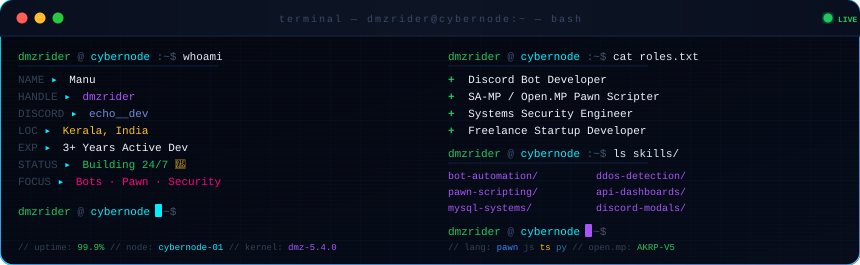
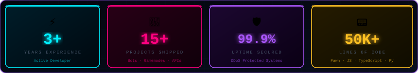
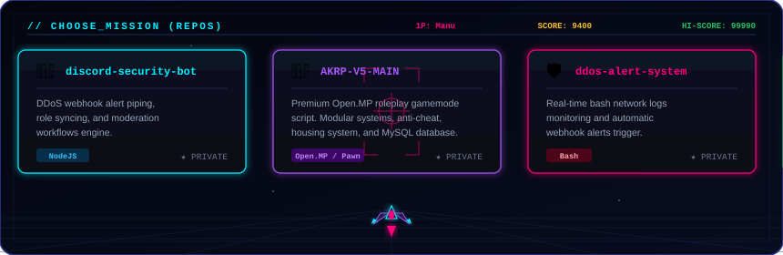
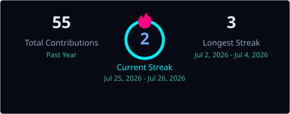
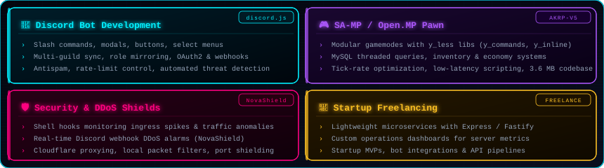

<!-- DYNAMIC BANNER -->

  

<!-- ⚡ TYPEWRITER WIDGET -->

  

 

<!-- 🟢 HUD STATUS BAR — FULL WIDTH -->

<svg xmlns="http://www.w3.org/2000/svg" viewBox="0 0 860 68" width="100%">
  <defs>
    <linearGradient id="hudbg" x1="0%" y1="0%" x2="100%" y2="0%">
      <stop offset="0%" stop-color="#040810"/>
      <stop offset="50%" stop-color="#080f1e"/>
      <stop offset="100%" stop-color="#040810"/>
    </linearGradient>
    <linearGradient id="hudTop" x1="0%" y1="0%" x2="100%" y2="0%">
      <stop offset="0%" stop-color="#00f0ff" stop-opacity="0"/>
      <stop offset="30%" stop-color="#00f0ff" stop-opacity="0.6"/>
      <stop offset="50%" stop-color="#a855f7" stop-opacity="0.8"/>
      <stop offset="70%" stop-color="#ff007f" stop-opacity="0.6"/>
      <stop offset="100%" stop-color="#ff007f" stop-opacity="0"/>
    </linearGradient>
    <filter id="hudGlow"><feGaussianBlur stdDeviation="2.5" result="b"/><feMerge><feMergeNode in="b"/><feMergeNode in="SourceGraphic"/></feMerge></filter>
    <filter id="hudDotGlow"><feGaussianBlur stdDeviation="3" result="b"/><feMerge><feMergeNode in="b"/><feMergeNode in="SourceGraphic"/></feMerge></filter>
  </defs>
  <rect width="860" height="68" rx="12" fill="url(#hudbg)" stroke="#1a2a4a" stroke-width="1.5"/>
  <!-- Top accent line -->
  <rect x="0" y="0" width="860" height="2.5" rx="2" fill="url(#hudTop)"/>
  <!-- Animated border -->
  <rect width="860" height="68" rx="12" fill="none" stroke="#22c55e" stroke-width="0.8">
    <animate attributeName="opacity" values="0.2;0.7;0.2" dur="3s" repeatCount="indefinite"/>
  </rect>
  <!-- Pulsing status dot -->
  <circle cx="28" cy="34" r="7" fill="#22c55e" filter="url(#hudDotGlow)">
    <animate attributeName="r" values="6;9;6" dur="1.5s" repeatCount="indefinite"/>
    <animate attributeName="opacity" values="0.7;1;0.7" dur="1.5s" repeatCount="indefinite"/>
  </circle>
  <circle cx="28" cy="34" r="3.5" fill="#ffffff"/>
  <!-- Status text -->
  <text x="48" y="26" font-family="'Courier New',Courier,monospace" font-size="9" fill="#22c55e" font-weight="bold" letter-spacing="2">AVAILABILITY STATUS</text>
  <text x="48" y="48" font-family="Arial,sans-serif" font-size="15" fill="#f1f5f9" font-weight="700">🟢 Open for Freelance &amp; Bot Dev Projects</text>
  <!-- Divider line -->
  <line x1="310" y1="16" x2="310" y2="54" stroke="#1a2a4a" stroke-width="1"/>
  <!-- Column 2: System -->
  <text x="340" y="26" font-family="'Courier New',Courier,monospace" font-size="9" fill="#64748b" letter-spacing="2">SYSTEM</text>
  <text x="340" y="46" font-family="'Courier New',Courier,monospace" font-size="11" fill="#00f0ff" font-weight="bold">cybernode-01 🟢</text>
  <!-- Divider line 2 -->
  <line x1="520" y1="16" x2="520" y2="54" stroke="#1a2a4a" stroke-width="1"/>
  <!-- Column 3: Uptime -->
  <text x="548" y="26" font-family="'Courier New',Courier,monospace" font-size="9" fill="#64748b" letter-spacing="2">UPTIME</text>
  <text x="548" y="46" font-family="'Courier New',Courier,monospace" font-size="11" fill="#a855f7" font-weight="bold">99.9% secured</text>
  <!-- Right CTA badge -->
  <rect x="685" y="18" width="160" height="32" rx="8" fill="#0a2014" stroke="#22c55e" stroke-width="1.2"/>
  <text x="765" y="38" font-family="'Courier New',Courier,monospace" font-size="10" fill="#4ade80" text-anchor="middle" font-weight="bold" letter-spacing="1">DM TO COLLABORATE</text>
</svg>

<!-- 📊 LIVE COUNTERS & BADGES -->

  
  &nbsp;&nbsp;
  
  &nbsp;&nbsp;
  
  &nbsp;&nbsp;
  
  &nbsp;&nbsp;
  
  &nbsp;&nbsp;
  

 

---

<!-- ============================================================ -->
<!--  SECTION: ABOUT ME                                           -->
<!-- ============================================================ -->

<svg xmlns="http://www.w3.org/2000/svg" viewBox="0 0 860 38" width="100%">
  <defs>
    <linearGradient id="sh1bg" x1="0%" y1="0%" x2="100%" y2="0%">
      <stop offset="0%" stop-color="#04060e"/>
      <stop offset="50%" stop-color="#080d1c"/>
      <stop offset="100%" stop-color="#04060e"/>
    </linearGradient>
    <linearGradient id="sh1line" x1="0%" y1="0%" x2="100%" y2="0%">
      <stop offset="0%" stop-color="#00f0ff" stop-opacity="0"/>
      <stop offset="20%" stop-color="#00f0ff" stop-opacity="0.6"/>
      <stop offset="50%" stop-color="#00f0ff" stop-opacity="1"/>
      <stop offset="80%" stop-color="#00f0ff" stop-opacity="0.6"/>
      <stop offset="100%" stop-color="#00f0ff" stop-opacity="0"/>
    </linearGradient>
  </defs>
  <rect width="860" height="38" rx="8" fill="url(#sh1bg)" stroke="#0f1e3a" stroke-width="1"/>
  <rect x="0" y="0" width="4" height="38" rx="3" fill="#00f0ff" opacity="0.8"/>
  <text x="22" y="14" font-family="'Courier New',Courier,monospace" font-size="8" fill="#00f0ff" letter-spacing="3" opacity="0.6">// SECTION</text>
  <text x="22" y="30" font-family="'Courier New',Courier,monospace" font-size="14" font-weight="bold" fill="#00f0ff" letter-spacing="2">👾 ABOUT ME</text>
  <!-- Right decorative brackets -->
  <text x="780" y="28" font-family="'Courier New',Courier,monospace" font-size="16" fill="#0f2040" text-anchor="end">{ whoami }</text>
  <rect x="0" y="36" width="860" height="1.5" fill="url(#sh1line)"/>
</svg>

 

  

 

---

<!-- ============================================================ -->
<!--  SECTION: CURRENTLY BUILDING                                 -->
<!-- ============================================================ -->

<svg xmlns="http://www.w3.org/2000/svg" viewBox="0 0 860 38" width="100%">
  <defs>
    <linearGradient id="sh2bg" x1="0%" y1="0%" x2="100%" y2="0%">
      <stop offset="0%" stop-color="#04060e"/>
      <stop offset="50%" stop-color="#080d1c"/>
      <stop offset="100%" stop-color="#04060e"/>
    </linearGradient>
    <linearGradient id="sh2line" x1="0%" y1="0%" x2="100%" y2="0%">
      <stop offset="0%" stop-color="#fbbf24" stop-opacity="0"/>
      <stop offset="20%" stop-color="#fbbf24" stop-opacity="0.6"/>
      <stop offset="50%" stop-color="#fbbf24" stop-opacity="1"/>
      <stop offset="80%" stop-color="#fbbf24" stop-opacity="0.6"/>
      <stop offset="100%" stop-color="#fbbf24" stop-opacity="0"/>
    </linearGradient>
  </defs>
  <rect width="860" height="38" rx="8" fill="url(#sh2bg)" stroke="#0f1e3a" stroke-width="1"/>
  <rect x="0" y="0" width="4" height="38" rx="3" fill="#fbbf24" opacity="0.8"/>
  <text x="22" y="14" font-family="'Courier New',Courier,monospace" font-size="8" fill="#fbbf24" letter-spacing="3" opacity="0.6">// SECTION</text>
  <text x="22" y="30" font-family="'Courier New',Courier,monospace" font-size="14" font-weight="bold" fill="#fbbf24" letter-spacing="2">🏗️ CURRENTLY BUILDING</text>
  <text x="780" y="28" font-family="'Courier New',Courier,monospace" font-size="16" fill="#0f2040" text-anchor="end">{ git log }</text>
  <rect x="0" y="36" width="860" height="1.5" fill="url(#sh2line)"/>
</svg>

 

<svg xmlns="http://www.w3.org/2000/svg" viewBox="0 0 860 150" width="100%">
  <defs>
    <linearGradient id="cbbg" x1="0%" y1="0%" x2="100%" y2="100%">
      <stop offset="0%" stop-color="#060c1a"/>
      <stop offset="100%" stop-color="#0c0e22"/>
    </linearGradient>
    <filter id="cbGlow"><feGaussianBlur stdDeviation="3" result="b"/><feMerge><feMergeNode in="b"/><feMergeNode in="SourceGraphic"/></feMerge></filter>
    <pattern id="cbGrid" x="0" y="0" width="20" height="20" patternUnits="userSpaceOnUse">
      <path d="M 20 0 L 0 0 0 20" fill="none" stroke="#0a1830" stroke-width="0.4"/>
    </pattern>
  </defs>
  <rect width="860" height="150" rx="12" fill="url(#cbbg)" stroke="#1e2d52" stroke-width="1.2"/>
  <rect width="860" height="150" rx="12" fill="url(#cbGrid)" opacity="0.5"/>
  <rect width="860" height="150" rx="12" fill="none" stroke="#fbbf24" stroke-width="1">
    <animate attributeName="opacity" values="0.2;0.6;0.2" dur="4s" repeatCount="indefinite"/>
  </rect>
  <!-- Terminal bar -->
  <rect x="0" y="0" width="860" height="28" rx="12" fill="#0b1526"/>
  <rect x="0" y="14" width="860" height="14" fill="#0b1526"/>
  <circle cx="20" cy="14" r="4.5" fill="#ff5f57"/>
  <circle cx="36" cy="14" r="4.5" fill="#febc2e"/>
  <circle cx="52" cy="14" r="4.5" fill="#28c840"/>
  <text x="430" y="19" text-anchor="middle" font-family="'Courier New',Courier,monospace" font-size="9" fill="#3a4a6a">build.log — dmzrider — active projects</text>
  <!-- Blinking build indicator -->
  <circle cx="820" cy="14" r="5" fill="#fbbf24" filter="url(#cbGlow)">
    <animate attributeName="opacity" values="1;0.2;1" dur="1s" repeatCount="indefinite"/>
  </circle>
  <text x="830" y="19" font-family="'Courier New',Courier,monospace" font-size="8" fill="#fbbf24">LIVE</text>
  <!-- Prompt -->
  <text x="24" y="50" font-family="'Courier New',Courier,monospace" font-size="11">
    <tspan fill="#6366f1">$</tspan>
    <tspan fill="#64748b"> git log --oneline --all --current</tspan>
  </text>
  <!-- Project 1: Discord Security Bot -->
  <text x="24" y="74" font-family="'Courier New',Courier,monospace" font-size="12">
    <tspan fill="#fbbf24" font-weight="bold">▶</tspan>
    <tspan fill="#f1f5f9" dx="6">Discord Security Bot v2.0</tspan>
    <tspan fill="#64748b" font-size="10" dx="8">— Advanced moderation + DDoS alert hooks</tspan>
  </text>
  <rect x="786" y="62" width="62" height="18" rx="5" fill="#1e1b4b" stroke="#6366f1" stroke-width="0.8"/>
  <text x="817" y="75" text-anchor="middle" font-family="'Courier New',Courier,monospace" font-size="8" fill="#a5b4fc">BUILDING</text>
  <!-- Project 2: AKRP-V5 -->
  <text x="24" y="100" font-family="'Courier New',Courier,monospace" font-size="12">
    <tspan fill="#22c55e" font-weight="bold">▶</tspan>
    <tspan fill="#f1f5f9" dx="6">AKRP-V5-MAIN — All Kerala Roleplay</tspan>
    <tspan fill="#64748b" font-size="10" dx="8">— Open.MP modular Pawn gamemode, 3.6 MB</tspan>
  </text>
  <rect x="786" y="88" width="62" height="18" rx="5" fill="#0f2000" stroke="#22c55e" stroke-width="0.8"/>
  <text x="817" y="101" text-anchor="middle" font-family="'Courier New',Courier,monospace" font-size="8" fill="#4ade80">ACTIVE</text>
  <!-- Project 3: NovaShield -->
  <text x="24" y="126" font-family="'Courier New',Courier,monospace" font-size="12">
    <tspan fill="#a855f7" font-weight="bold">▶</tspan>
    <tspan fill="#f1f5f9" dx="6">NovaShield — Packet Defense Engine</tspan>
    <tspan fill="#64748b" font-size="10" dx="8">— Real-time DDoS mitigation &amp; firewall filters</tspan>
  </text>
  <rect x="786" y="114" width="62" height="18" rx="5" fill="#1a002e" stroke="#a855f7" stroke-width="0.8"/>
  <text x="817" y="127" text-anchor="middle" font-family="'Courier New',Courier,monospace" font-size="8" fill="#c084fc">PUBLIC</text>
</svg>

 

---

<!-- ============================================================ -->
<!--  SECTION: ACHIEVEMENTS                                       -->
<!-- ============================================================ -->

<svg xmlns="http://www.w3.org/2000/svg" viewBox="0 0 860 38" width="100%">
  <defs>
    <linearGradient id="sh3bg" x1="0%" y1="0%" x2="100%" y2="0%">
      <stop offset="0%" stop-color="#04060e"/>
      <stop offset="50%" stop-color="#080d1c"/>
      <stop offset="100%" stop-color="#04060e"/>
    </linearGradient>
    <linearGradient id="sh3line" x1="0%" y1="0%" x2="100%" y2="0%">
      <stop offset="0%" stop-color="#ff007f" stop-opacity="0"/>
      <stop offset="20%" stop-color="#ff007f" stop-opacity="0.6"/>
      <stop offset="50%" stop-color="#ff007f" stop-opacity="1"/>
      <stop offset="80%" stop-color="#ff007f" stop-opacity="0.6"/>
      <stop offset="100%" stop-color="#ff007f" stop-opacity="0"/>
    </linearGradient>
  </defs>
  <rect width="860" height="38" rx="8" fill="url(#sh3bg)" stroke="#0f1e3a" stroke-width="1"/>
  <rect x="0" y="0" width="4" height="38" rx="3" fill="#ff007f" opacity="0.8"/>
  <text x="22" y="14" font-family="'Courier New',Courier,monospace" font-size="8" fill="#ff007f" letter-spacing="3" opacity="0.6">// SECTION</text>
  <text x="22" y="30" font-family="'Courier New',Courier,monospace" font-size="14" font-weight="bold" fill="#ff007f" letter-spacing="2">🏆 ACHIEVEMENTS &amp; MILESTONES</text>
  <text x="780" y="28" font-family="'Courier New',Courier,monospace" font-size="16" fill="#0f2040" text-anchor="end">{ metrics }</text>
  <rect x="0" y="36" width="860" height="1.5" fill="url(#sh3line)"/>
</svg>

 

  

 

---

<!-- ============================================================ -->
<!--  SECTION: TECH STACK                                         -->
<!-- ============================================================ -->

<svg xmlns="http://www.w3.org/2000/svg" viewBox="0 0 860 38" width="100%">
  <defs>
    <linearGradient id="sh4bg" x1="0%" y1="0%" x2="100%" y2="0%">
      <stop offset="0%" stop-color="#04060e"/>
      <stop offset="50%" stop-color="#080d1c"/>
      <stop offset="100%" stop-color="#04060e"/>
    </linearGradient>
    <linearGradient id="sh4line" x1="0%" y1="0%" x2="100%" y2="0%">
      <stop offset="0%" stop-color="#a855f7" stop-opacity="0"/>
      <stop offset="20%" stop-color="#a855f7" stop-opacity="0.6"/>
      <stop offset="50%" stop-color="#a855f7" stop-opacity="1"/>
      <stop offset="80%" stop-color="#a855f7" stop-opacity="0.6"/>
      <stop offset="100%" stop-color="#a855f7" stop-opacity="0"/>
    </linearGradient>
  </defs>
  <rect width="860" height="38" rx="8" fill="url(#sh4bg)" stroke="#0f1e3a" stroke-width="1"/>
  <rect x="0" y="0" width="4" height="38" rx="3" fill="#a855f7" opacity="0.8"/>
  <text x="22" y="14" font-family="'Courier New',Courier,monospace" font-size="8" fill="#a855f7" letter-spacing="3" opacity="0.6">// SECTION</text>
  <text x="22" y="30" font-family="'Courier New',Courier,monospace" font-size="14" font-weight="bold" fill="#a855f7" letter-spacing="2">💻 SKILL MATRIX &amp; TECH STACK</text>
  <text x="780" y="28" font-family="'Courier New',Courier,monospace" font-size="16" fill="#0f2040" text-anchor="end">{ stack }</text>
  <rect x="0" y="36" width="860" height="1.5" fill="url(#sh4line)"/>
</svg>

 

  <table border="0" cellspacing="0" cellpadding="8">
    <tr>
      <td align="center" width="155"><b>🤖 Automation &amp; Bots</b></td>
      <td align="center" width="280">
        
      </td>
      <td width="380">Custom Discord bots, permission workflows, webhook piping, interactive buttons &amp; modals.</td>
    </tr>
    <tr>
      <td align="center"><b>🎮 Game Development</b></td>
      <td align="center">
        
      </td>
      <td>Custom game server scripting, MySQL query optimization, tick-based systems, and modular gamemode design.</td>
    </tr>
    <tr>
      <td align="center"><b>🗄️ Database &amp; Systems</b></td>
      <td align="center">
        
      </td>
      <td>Database normalization, secure pipeline configs, localized hosting setups, and containerization.</td>
    </tr>
    <tr>
      <td align="center"><b>🛡️ Cloud &amp; Security</b></td>
      <td align="center">
        
      </td>
      <td>Network traffic shielding, DDoS alert automation via bash script triggers, version control, IDE workflows.</td>
    </tr>
  </table>

 

---

<!-- ============================================================ -->
<!--  SECTION: PINNED PROJECTS                                    -->
<!-- ============================================================ -->

<svg xmlns="http://www.w3.org/2000/svg" viewBox="0 0 860 38" width="100%">
  <defs>
    <linearGradient id="sh5bg" x1="0%" y1="0%" x2="100%" y2="0%">
      <stop offset="0%" stop-color="#04060e"/>
      <stop offset="50%" stop-color="#080d1c"/>
      <stop offset="100%" stop-color="#04060e"/>
    </linearGradient>
    <linearGradient id="sh5line" x1="0%" y1="0%" x2="100%" y2="0%">
      <stop offset="0%" stop-color="#22c55e" stop-opacity="0"/>
      <stop offset="20%" stop-color="#22c55e" stop-opacity="0.6"/>
      <stop offset="50%" stop-color="#22c55e" stop-opacity="1"/>
      <stop offset="80%" stop-color="#22c55e" stop-opacity="0.6"/>
      <stop offset="100%" stop-color="#22c55e" stop-opacity="0"/>
    </linearGradient>
  </defs>
  <rect width="860" height="38" rx="8" fill="url(#sh5bg)" stroke="#0f1e3a" stroke-width="1"/>
  <rect x="0" y="0" width="4" height="38" rx="3" fill="#22c55e" opacity="0.8"/>
  <text x="22" y="14" font-family="'Courier New',Courier,monospace" font-size="8" fill="#22c55e" letter-spacing="3" opacity="0.6">// SECTION</text>
  <text x="22" y="30" font-family="'Courier New',Courier,monospace" font-size="14" font-weight="bold" fill="#22c55e" letter-spacing="2">📌 PINNED PROJECT SHOWCASE</text>
  <text x="780" y="28" font-family="'Courier New',Courier,monospace" font-size="16" fill="#0f2040" text-anchor="end">{ arcade }</text>
  <rect x="0" y="36" width="860" height="1.5" fill="url(#sh5line)"/>
</svg>

 

  

> 💡 *AKRP-V5-MAIN and MazhaV1 are in private repos — public releases coming soon!*

 

---

<!-- ============================================================ -->
<!--  SECTION: GITHUB ANALYTICS                                   -->
<!-- ============================================================ -->

<svg xmlns="http://www.w3.org/2000/svg" viewBox="0 0 860 38" width="100%">
  <defs>
    <linearGradient id="sh6bg" x1="0%" y1="0%" x2="100%" y2="0%">
      <stop offset="0%" stop-color="#04060e"/>
      <stop offset="50%" stop-color="#080d1c"/>
      <stop offset="100%" stop-color="#04060e"/>
    </linearGradient>
    <linearGradient id="sh6line" x1="0%" y1="0%" x2="100%" y2="0%">
      <stop offset="0%" stop-color="#00f0ff" stop-opacity="0"/>
      <stop offset="30%" stop-color="#00f0ff" stop-opacity="0.8"/>
      <stop offset="50%" stop-color="#a855f7" stop-opacity="1"/>
      <stop offset="70%" stop-color="#ff007f" stop-opacity="0.8"/>
      <stop offset="100%" stop-color="#ff007f" stop-opacity="0"/>
    </linearGradient>
  </defs>
  <rect width="860" height="38" rx="8" fill="url(#sh6bg)" stroke="#0f1e3a" stroke-width="1"/>
  <rect x="0" y="0" width="4" height="38" rx="3" fill="#00f0ff" opacity="0.8"/>
  <text x="22" y="14" font-family="'Courier New',Courier,monospace" font-size="8" fill="#00f0ff" letter-spacing="3" opacity="0.6">// SECTION</text>
  <text x="22" y="30" font-family="'Courier New',Courier,monospace" font-size="14" font-weight="bold" fill="#00f0ff" letter-spacing="2">📊 GITHUB ANALYTICS &amp; DIAGNOSTICS</text>
  <text x="780" y="28" font-family="'Courier New',Courier,monospace" font-size="16" fill="#0f2040" text-anchor="end">{ telemetry }</text>
  <rect x="0" y="36" width="860" height="1.5" fill="url(#sh6line)"/>
</svg>

 

  <table border="0">
    <tr>
      <td align="center" valign="top">
        
      </td>
      <td align="center" valign="top">
        
      </td>
    </tr>
  </table>

 

<!-- ⚡ REPOSITORY LANGUAGE TELEMETRY -->

<!-- START_SECTION:languages -->
<svg xmlns="http://www.w3.org/2000/svg" viewBox="0 0 495 220" width="495">
  <defs>
    <linearGradient id="wkbg" x1="0%" y1="0%" x2="100%" y2="100%">
      <stop offset="0%" stop-color="#070a13"/>
      <stop offset="100%" stop-color="#0d1117"/>
    </linearGradient>
    <linearGradient id="barPawnSAMP" x1="0%" y1="0%" x2="100%" y2="0%">
      <stop offset="0%" stop-color="#3b82f6"/><stop offset="100%" stop-color="#60a5fa"/>
    </linearGradient>
    <linearGradient id="barJavaScript" x1="0%" y1="0%" x2="100%" y2="0%">
      <stop offset="0%" stop-color="#f7df1e"/><stop offset="100%" stop-color="#f1e05a"/>
    </linearGradient>
    <linearGradient id="barTypeScript" x1="0%" y1="0%" x2="100%" y2="0%">
      <stop offset="0%" stop-color="#3178c6"/><stop offset="100%" stop-color="#60a5fa"/>
    </linearGradient>
    <linearGradient id="barSQLMySQL" x1="0%" y1="0%" x2="100%" y2="0%">
      <stop offset="0%" stop-color="#00a3cc"/><stop offset="100%" stop-color="#00e5ff"/>
    </linearGradient>
    <linearGradient id="barPython" x1="0%" y1="0%" x2="100%" y2="0%">
      <stop offset="0%" stop-color="#3572A5"/><stop offset="100%" stop-color="#4584b6"/>
    </linearGradient>
    <filter id="wkGlow"><feGaussianBlur stdDeviation="2" result="b"/><feMerge><feMergeNode in="b"/><feMergeNode in="SourceGraphic"/></feMerge></filter>
  </defs>
  <rect width="495" height="220" rx="10" fill="url(#wkbg)" stroke="#1a233a" stroke-width="1.2"/>
  <rect width="495" height="220" rx="10" fill="none" stroke="#a855f7" stroke-width="1.2" opacity="0.3">
    <animate attributeName="opacity" values="0.2;0.6;0.2" dur="3s" repeatCount="indefinite"/>
  </rect>

  <!-- Title -->
  <text x="30" y="32" font-family="'Courier New',Courier,monospace" font-size="12" font-weight="bold" fill="#a855f7" letter-spacing="1">⚡ REPOSITORY LANGUAGE METRICS</text>
  <text x="465" y="31" font-family="'Courier New',Courier,monospace" font-size="9" fill="#64748b" text-anchor="end">Metrics: Dynamic Source</text>

  <!-- Pawn (SA-MP) -->
  <g transform="translate(30, 48)">
    <text x="0" y="12" font-family="Arial,sans-serif" font-size="11" font-weight="bold" fill="#e2e8f0">Pawn (SA-MP)</text>
    <text x="100" y="12" font-family="'Courier New',Courier,monospace" font-size="10" fill="#3b82f6">3.6 MB</text>
    <rect x="160" y="3" width="220" height="9" rx="4.5" fill="#161b22"/>
    <rect x="160" y="3" width="0" height="9" rx="4.5" fill="url(#barPawnSAMP)">
      <animate attributeName="width" values="0;195;195" dur="1.5s" fill="freeze" begin="0.2s"/>
    </rect>
    <text x="390" y="11" font-family="'Courier New',Courier,monospace" font-size="10" fill="#3b82f6">89%</text>
  </g>
  <!-- JavaScript -->
  <g transform="translate(30, 76)">
    <text x="0" y="12" font-family="Arial,sans-serif" font-size="11" font-weight="bold" fill="#e2e8f0">JavaScript</text>
    <text x="100" y="12" font-family="'Courier New',Courier,monospace" font-size="10" fill="#f7df1e">205 KB</text>
    <rect x="160" y="3" width="220" height="9" rx="4.5" fill="#161b22"/>
    <rect x="160" y="3" width="0" height="9" rx="4.5" fill="url(#barJavaScript)">
      <animate attributeName="width" values="0;11;11" dur="1.5s" fill="freeze" begin="0.4s"/>
    </rect>
    <text x="390" y="11" font-family="'Courier New',Courier,monospace" font-size="10" fill="#f7df1e">5%</text>
  </g>
  <!-- TypeScript -->
  <g transform="translate(30, 104)">
    <text x="0" y="12" font-family="Arial,sans-serif" font-size="11" font-weight="bold" fill="#e2e8f0">TypeScript</text>
    <text x="100" y="12" font-family="'Courier New',Courier,monospace" font-size="10" fill="#3178c6">150 KB</text>
    <rect x="160" y="3" width="220" height="9" rx="4.5" fill="#161b22"/>
    <rect x="160" y="3" width="0" height="9" rx="4.5" fill="url(#barTypeScript)">
      <animate attributeName="width" values="0;8;8" dur="1.5s" fill="freeze" begin="0.6s"/>
    </rect>
    <text x="390" y="11" font-family="'Courier New',Courier,monospace" font-size="10" fill="#3178c6">4%</text>
  </g>
  <!-- SQL/MySQL -->
  <g transform="translate(30, 132)">
    <text x="0" y="12" font-family="Arial,sans-serif" font-size="11" font-weight="bold" fill="#e2e8f0">SQL/MySQL</text>
    <text x="100" y="12" font-family="'Courier New',Courier,monospace" font-size="10" fill="#00a3cc">80 KB</text>
    <rect x="160" y="3" width="220" height="9" rx="4.5" fill="#161b22"/>
    <rect x="160" y="3" width="0" height="9" rx="4.5" fill="url(#barSQLMySQL)">
      <animate attributeName="width" values="0;4;4" dur="1.5s" fill="freeze" begin="0.8s"/>
    </rect>
    <text x="390" y="11" font-family="'Courier New',Courier,monospace" font-size="10" fill="#00a3cc">2%</text>
  </g>
  <!-- Python -->
  <g transform="translate(30, 160)">
    <text x="0" y="12" font-family="Arial,sans-serif" font-size="11" font-weight="bold" fill="#e2e8f0">Python</text>
    <text x="100" y="12" font-family="'Courier New',Courier,monospace" font-size="10" fill="#3572A5">26 KB</text>
    <rect x="160" y="3" width="220" height="9" rx="4.5" fill="#161b22"/>
    <rect x="160" y="3" width="0" height="9" rx="4.5" fill="url(#barPython)">
      <animate attributeName="width" values="0;2;2" dur="1.5s" fill="freeze" begin="1.0s"/>
    </rect>
    <text x="390" y="11" font-family="'Courier New',Courier,monospace" font-size="10" fill="#3572A5">1%</text>
  </g>
</svg>
<!-- END_SECTION:languages -->

 

  

 

  

 

---

<!-- ============================================================ -->
<!--  SECTION: CONTRIBUTION ACTIVITY                              -->
<!-- ============================================================ -->

<svg xmlns="http://www.w3.org/2000/svg" viewBox="0 0 860 38" width="100%">
  <defs>
    <linearGradient id="sh7bg" x1="0%" y1="0%" x2="100%" y2="0%">
      <stop offset="0%" stop-color="#04060e"/>
      <stop offset="50%" stop-color="#080d1c"/>
      <stop offset="100%" stop-color="#04060e"/>
    </linearGradient>
    <linearGradient id="sh7line" x1="0%" y1="0%" x2="100%" y2="0%">
      <stop offset="0%" stop-color="#38bdf8" stop-opacity="0"/>
      <stop offset="20%" stop-color="#38bdf8" stop-opacity="0.6"/>
      <stop offset="50%" stop-color="#38bdf8" stop-opacity="1"/>
      <stop offset="80%" stop-color="#38bdf8" stop-opacity="0.6"/>
      <stop offset="100%" stop-color="#38bdf8" stop-opacity="0"/>
    </linearGradient>
  </defs>
  <rect width="860" height="38" rx="8" fill="url(#sh7bg)" stroke="#0f1e3a" stroke-width="1"/>
  <rect x="0" y="0" width="4" height="38" rx="3" fill="#38bdf8" opacity="0.8"/>
  <text x="22" y="14" font-family="'Courier New',Courier,monospace" font-size="8" fill="#38bdf8" letter-spacing="3" opacity="0.6">// SECTION</text>
  <text x="22" y="30" font-family="'Courier New',Courier,monospace" font-size="14" font-weight="bold" fill="#38bdf8" letter-spacing="2">📡 CONTRIBUTION ACTIVITY OVERVIEW</text>
  <text x="780" y="28" font-family="'Courier New',Courier,monospace" font-size="16" fill="#0f2040" text-anchor="end">{ radar }</text>
  <rect x="0" y="36" width="860" height="1.5" fill="url(#sh7line)"/>
</svg>

 

  

 

  

 

---

<!-- 🐍 ARCADE SNAKE CONTRIBUTION GAME -->

<svg xmlns="http://www.w3.org/2000/svg" viewBox="0 0 860 38" width="100%">
  <defs>
    <linearGradient id="sh8bg" x1="0%" y1="0%" x2="100%" y2="0%">
      <stop offset="0%" stop-color="#04060e"/>
      <stop offset="50%" stop-color="#080d1c"/>
      <stop offset="100%" stop-color="#04060e"/>
    </linearGradient>
    <linearGradient id="sh8line" x1="0%" y1="0%" x2="100%" y2="0%">
      <stop offset="0%" stop-color="#28c840" stop-opacity="0"/>
      <stop offset="20%" stop-color="#28c840" stop-opacity="0.6"/>
      <stop offset="50%" stop-color="#28c840" stop-opacity="1"/>
      <stop offset="80%" stop-color="#28c840" stop-opacity="0.6"/>
      <stop offset="100%" stop-color="#28c840" stop-opacity="0"/>
    </linearGradient>
  </defs>
  <rect width="860" height="38" rx="8" fill="url(#sh8bg)" stroke="#0f1e3a" stroke-width="1"/>
  <rect x="0" y="0" width="4" height="38" rx="3" fill="#28c840" opacity="0.8"/>
  <text x="22" y="14" font-family="'Courier New',Courier,monospace" font-size="8" fill="#28c840" letter-spacing="3" opacity="0.6">// SECTION</text>
  <text x="22" y="30" font-family="'Courier New',Courier,monospace" font-size="14" font-weight="bold" fill="#28c840" letter-spacing="2">🎮 CONTRIBUTION ARCADE SNAKE</text>
  <text x="780" y="28" font-family="'Courier New',Courier,monospace" font-size="16" fill="#0f2040" text-anchor="end">{ game }</text>
  <rect x="0" y="36" width="860" height="1.5" fill="url(#sh8line)"/>
</svg>

 

  <picture>
    <source media="(prefers-color-scheme: dark)" srcset="github-contribution-grid-snake-dark-v2.svg">
    <source media="(prefers-color-scheme: light)" srcset="github-contribution-grid-snake-v2.svg">
    
  </picture>

 

---

<!-- 💡 QUOTE & JOKE -->

  

 

  

 

---

<!-- ============================================================ -->
<!--  SECTION: GLOBAL REACH                                       -->
<!-- ============================================================ -->

<svg xmlns="http://www.w3.org/2000/svg" viewBox="0 0 860 38" width="100%">
  <defs>
    <linearGradient id="sh9bg" x1="0%" y1="0%" x2="100%" y2="0%">
      <stop offset="0%" stop-color="#04060e"/>
      <stop offset="50%" stop-color="#080d1c"/>
      <stop offset="100%" stop-color="#04060e"/>
    </linearGradient>
    <linearGradient id="sh9line" x1="0%" y1="0%" x2="100%" y2="0%">
      <stop offset="0%" stop-color="#4f46e5" stop-opacity="0"/>
      <stop offset="20%" stop-color="#4f46e5" stop-opacity="0.6"/>
      <stop offset="50%" stop-color="#4f46e5" stop-opacity="1"/>
      <stop offset="80%" stop-color="#4f46e5" stop-opacity="0.6"/>
      <stop offset="100%" stop-color="#4f46e5" stop-opacity="0"/>
    </linearGradient>
  </defs>
  <rect width="860" height="38" rx="8" fill="url(#sh9bg)" stroke="#0f1e3a" stroke-width="1"/>
  <rect x="0" y="0" width="4" height="38" rx="3" fill="#4f46e5" opacity="0.8"/>
  <text x="22" y="14" font-family="'Courier New',Courier,monospace" font-size="8" fill="#4f46e5" letter-spacing="3" opacity="0.6">// SECTION</text>
  <text x="22" y="30" font-family="'Courier New',Courier,monospace" font-size="14" font-weight="bold" fill="#4f46e5" letter-spacing="2">🌍 GLOBAL REACH</text>
  <text x="780" y="28" font-family="'Courier New',Courier,monospace" font-size="16" fill="#0f2040" text-anchor="end">{ network }</text>
  <rect x="0" y="36" width="860" height="1.5" fill="url(#sh9line)"/>
</svg>

 

<svg xmlns="http://www.w3.org/2000/svg" viewBox="0 0 860 220" width="100%">
  <defs>
    <linearGradient id="globebg" x1="0%" y1="0%" x2="100%" y2="100%"><stop offset="0%" stop-color="#04060f"/><stop offset="100%" stop-color="#080d1c"/></linearGradient>
    <radialGradient id="glowCenter" cx="50%" cy="50%" r="50%"><stop offset="0%" stop-color="#00f0ff" stop-opacity="0.08"/><stop offset="100%" stop-color="#00f0ff" stop-opacity="0"/></radialGradient>
    <filter id="dotGlow"><feGaussianBlur stdDeviation="2.5" result="b"/><feMerge><feMergeNode in="b"/><feMergeNode in="SourceGraphic"/></feMerge></filter>
    <pattern id="globeGrid" x="0" y="0" width="20" height="20" patternUnits="userSpaceOnUse">
      <path d="M 20 0 L 0 0 0 20" fill="none" stroke="#0a1830" stroke-width="0.4"/>
    </pattern>
  </defs>
  <rect width="860" height="220" rx="13" fill="url(#globebg)" stroke="#1e2d52" stroke-width="1"/>
  <rect width="860" height="220" rx="13" fill="url(#globeGrid)" opacity="0.5"/>
  <rect width="860" height="220" rx="13" fill="none" stroke="#4f46e5" stroke-width="1">
    <animate attributeName="opacity" values="0.2;0.5;0.2" dur="4s" repeatCount="indefinite"/>
  </rect>
  <!-- Title -->
  <text x="430" y="28" text-anchor="middle" font-family="'Courier New',Courier,monospace" font-size="11" font-weight="bold" fill="#00f0ff" letter-spacing="3" opacity="0.85">// GLOBAL_REACH</text>
  <!-- Globe circle -->
  <circle cx="430" cy="125" r="82" fill="none" stroke="#1e3a5f" stroke-width="1" opacity="0.6"/>
  <circle cx="430" cy="125" r="82" fill="url(#glowCenter)"/>
  <!-- Latitude lines -->
  <ellipse cx="430" cy="125" rx="82" ry="20" fill="none" stroke="#1e3a5f" stroke-width="0.7" opacity="0.5"/>
  <ellipse cx="430" cy="95" rx="70" ry="17" fill="none" stroke="#1e3a5f" stroke-width="0.5" opacity="0.4"/>
  <ellipse cx="430" cy="155" rx="70" ry="17" fill="none" stroke="#1e3a5f" stroke-width="0.5" opacity="0.4"/>
  <line x1="430" y1="43" x2="430" y2="207" stroke="#1e3a5f" stroke-width="0.7" opacity="0.5"/>
  <line x1="348" y1="125" x2="512" y2="125" stroke="#1e3a5f" stroke-width="0.7" opacity="0.5"/>
  <!-- Connection lines to dots -->
  <line x1="430" y1="125" x2="178" y2="125" stroke="#00f0ff" stroke-width="0.6" stroke-dasharray="3 3" opacity="0.3"/>
  <line x1="430" y1="125" x2="310" y2="78" stroke="#a855f7" stroke-width="0.6" stroke-dasharray="3 3" opacity="0.3"/>
  <line x1="430" y1="125" x2="580" y2="90" stroke="#ff007f" stroke-width="0.6" stroke-dasharray="3 3" opacity="0.3"/>
  <line x1="430" y1="125" x2="720" y2="108" stroke="#fbbf24" stroke-width="0.6" stroke-dasharray="3 3" opacity="0.3"/>
  <line x1="430" y1="125" x2="520" y2="165" stroke="#22c55e" stroke-width="0.6" stroke-dasharray="3 3" opacity="0.3"/>
  <!-- India (home) -->
  <circle cx="430" cy="125" r="8" fill="#00f0ff" filter="url(#dotGlow)">
    <animate attributeName="r" values="7;11;7" dur="2s" repeatCount="indefinite"/>
    <animate attributeName="opacity" values="0.8;1;0.8" dur="2s" repeatCount="indefinite"/>
  </circle>
  <circle cx="430" cy="125" r="3" fill="#ffffff"/>
  <text x="430" y="148" text-anchor="middle" font-family="'Courier New',Courier,monospace" font-size="8" fill="#00f0ff">🏠 Kerala, India</text>
  <!-- USA -->
  <circle cx="178" cy="125" r="5" fill="#a855f7" filter="url(#dotGlow)">
    <animate attributeName="opacity" values="0.5;1;0.5" dur="3s" repeatCount="indefinite"/>
  </circle>
  <text x="178" y="143" text-anchor="middle" font-family="'Courier New',Courier,monospace" font-size="8" fill="#a855f7">USA</text>
  <!-- Europe -->
  <circle cx="310" cy="78" r="5" fill="#ff007f" filter="url(#dotGlow)">
    <animate attributeName="opacity" values="0.5;1;0.5" dur="2.5s" repeatCount="indefinite"/>
  </circle>
  <text x="310" y="70" text-anchor="middle" font-family="'Courier New',Courier,monospace" font-size="8" fill="#ff007f">Europe</text>
  <!-- SE Asia -->
  <circle cx="580" cy="90" r="5" fill="#fbbf24" filter="url(#dotGlow)">
    <animate attributeName="opacity" values="0.5;1;0.5" dur="3.5s" repeatCount="indefinite"/>
  </circle>
  <text x="580" y="82" text-anchor="middle" font-family="'Courier New',Courier,monospace" font-size="8" fill="#fbbf24">SE Asia</text>
  <!-- Middle East -->
  <circle cx="520" cy="165" r="5" fill="#22c55e" filter="url(#dotGlow)">
    <animate attributeName="opacity" values="0.5;1;0.5" dur="4s" repeatCount="indefinite"/>
  </circle>
  <text x="520" y="182" text-anchor="middle" font-family="'Courier New',Courier,monospace" font-size="8" fill="#22c55e">Middle East</text>
  <!-- Australia -->
  <circle cx="720" cy="108" r="5" fill="#38bdf8" filter="url(#dotGlow)">
    <animate attributeName="opacity" values="0.5;1;0.5" dur="2.8s" repeatCount="indefinite"/>
  </circle>
  <text x="720" y="100" text-anchor="middle" font-family="'Courier New',Courier,monospace" font-size="8" fill="#38bdf8">Australia</text>
  <!-- Stats row -->
  <text x="90" y="200" text-anchor="middle" font-family="'Courier New',Courier,monospace" font-size="10" fill="#64748b">Profile Visitors</text>
  <text x="90" y="214" text-anchor="middle" font-family="'Courier New',Courier,monospace" font-size="13" fill="#00f0ff" font-weight="bold">🌐 Global</text>
  <text x="270" y="200" text-anchor="middle" font-family="'Courier New',Courier,monospace" font-size="10" fill="#64748b">Regions Reached</text>
  <text x="270" y="214" text-anchor="middle" font-family="'Courier New',Courier,monospace" font-size="13" fill="#a855f7" font-weight="bold">6+ Regions</text>
  <text x="590" y="200" text-anchor="middle" font-family="'Courier New',Courier,monospace" font-size="10" fill="#64748b">Based In</text>
  <text x="590" y="214" text-anchor="middle" font-family="'Courier New',Courier,monospace" font-size="13" fill="#fbbf24" font-weight="bold">🇮🇳 Kerala, India</text>
  <text x="770" y="200" text-anchor="middle" font-family="'Courier New',Courier,monospace" font-size="10" fill="#64748b">Availability</text>
  <text x="770" y="214" text-anchor="middle" font-family="'Courier New',Courier,monospace" font-size="13" fill="#22c55e" font-weight="bold">🟢 Open</text>
</svg>

---

<!-- ============================================================ -->
<!--  SECTION: SPECIALTIES                                        -->
<!-- ============================================================ -->

<svg xmlns="http://www.w3.org/2000/svg" viewBox="0 0 860 38" width="100%">
  <defs>
    <linearGradient id="sh10bg" x1="0%" y1="0%" x2="100%" y2="0%">
      <stop offset="0%" stop-color="#04060e"/>
      <stop offset="50%" stop-color="#080d1c"/>
      <stop offset="100%" stop-color="#04060e"/>
    </linearGradient>
    <linearGradient id="sh10line" x1="0%" y1="0%" x2="100%" y2="0%">
      <stop offset="0%" stop-color="#fbbf24" stop-opacity="0"/>
      <stop offset="20%" stop-color="#fbbf24" stop-opacity="0.6"/>
      <stop offset="50%" stop-color="#00f0ff" stop-opacity="1"/>
      <stop offset="80%" stop-color="#a855f7" stop-opacity="0.6"/>
      <stop offset="100%" stop-color="#a855f7" stop-opacity="0"/>
    </linearGradient>
  </defs>
  <rect width="860" height="38" rx="8" fill="url(#sh10bg)" stroke="#0f1e3a" stroke-width="1"/>
  <rect x="0" y="0" width="4" height="38" rx="3" fill="#fbbf24" opacity="0.8"/>
  <text x="22" y="14" font-family="'Courier New',Courier,monospace" font-size="8" fill="#fbbf24" letter-spacing="3" opacity="0.6">// SECTION</text>
  <text x="22" y="30" font-family="'Courier New',Courier,monospace" font-size="14" font-weight="bold" fill="#fbbf24" letter-spacing="2">🛠️ SPECIALTIES &amp; FOCUS AREAS</text>
  <text x="780" y="28" font-family="'Courier New',Courier,monospace" font-size="16" fill="#0f2040" text-anchor="end">{ focus }</text>
  <rect x="0" y="36" width="860" height="1.5" fill="url(#sh10line)"/>
</svg>

 

  

 

---

<!-- ============================================================ -->
<!--  SECTION: CONNECT                                            -->
<!-- ============================================================ -->

<svg xmlns="http://www.w3.org/2000/svg" viewBox="0 0 860 38" width="100%">
  <defs>
    <linearGradient id="sh11bg" x1="0%" y1="0%" x2="100%" y2="0%">
      <stop offset="0%" stop-color="#04060e"/>
      <stop offset="50%" stop-color="#080d1c"/>
      <stop offset="100%" stop-color="#04060e"/>
    </linearGradient>
    <linearGradient id="sh11line" x1="0%" y1="0%" x2="100%" y2="0%">
      <stop offset="0%" stop-color="#5865f2" stop-opacity="0"/>
      <stop offset="20%" stop-color="#5865f2" stop-opacity="0.6"/>
      <stop offset="50%" stop-color="#5865f2" stop-opacity="1"/>
      <stop offset="80%" stop-color="#5865f2" stop-opacity="0.6"/>
      <stop offset="100%" stop-color="#5865f2" stop-opacity="0"/>
    </linearGradient>
  </defs>
  <rect width="860" height="38" rx="8" fill="url(#sh11bg)" stroke="#0f1e3a" stroke-width="1"/>
  <rect x="0" y="0" width="4" height="38" rx="3" fill="#5865f2" opacity="0.8"/>
  <text x="22" y="14" font-family="'Courier New',Courier,monospace" font-size="8" fill="#5865f2" letter-spacing="3" opacity="0.6">// SECTION</text>
  <text x="22" y="30" font-family="'Courier New',Courier,monospace" font-size="14" font-weight="bold" fill="#5865f2" letter-spacing="2">📬 CONNECT WITH ME</text>
  <text x="780" y="28" font-family="'Courier New',Courier,monospace" font-size="16" fill="#0f2040" text-anchor="end">{ find me }</text>
  <rect x="0" y="36" width="860" height="1.5" fill="url(#sh11line)"/>
</svg>

 

<svg xmlns="http://www.w3.org/2000/svg" viewBox="0 0 860 150" width="100%">
  <defs>
    <linearGradient id="connbg" x1="0%" y1="0%" x2="100%" y2="100%">
      <stop offset="0%" stop-color="#060c1a"/>
      <stop offset="100%" stop-color="#0e0a24"/>
    </linearGradient>
    <filter id="connGlow"><feGaussianBlur stdDeviation="3" result="b"/><feMerge><feMergeNode in="b"/><feMergeNode in="SourceGraphic"/></feMerge></filter>
    <pattern id="connGrid" x="0" y="0" width="20" height="20" patternUnits="userSpaceOnUse">
      <path d="M 20 0 L 0 0 0 20" fill="none" stroke="#0a1830" stroke-width="0.4"/>
    </pattern>
    <linearGradient id="connBorder" x1="0%" y1="0%" x2="100%" y2="100%">
      <stop offset="0%" stop-color="#6366f1"/>
      <stop offset="50%" stop-color="#00f0ff"/>
      <stop offset="100%" stop-color="#a855f7"/>
    </linearGradient>
  </defs>
  <rect width="860" height="150" rx="14" fill="url(#connbg)" stroke="#1e2d52" stroke-width="1.2"/>
  <rect width="860" height="150" rx="14" fill="url(#connGrid)" opacity="0.4"/>
  <rect width="860" height="150" rx="14" fill="none" stroke="url(#connBorder)" stroke-width="1.5">
    <animate attributeName="opacity" values="0.3;0.8;0.3" dur="4s" repeatCount="indefinite"/>
  </rect>
  <text x="430" y="32" text-anchor="middle" font-family="'Courier New',Courier,monospace" font-size="11" font-weight="bold" fill="#00f0ff" letter-spacing="3" opacity="0.85">// FIND ME ON</text>
  <!-- GitHub card -->
  <rect x="22" y="50" width="178" height="80" rx="10" fill="#080d1c" stroke="#30363d" stroke-width="1.2"/>
  <rect x="22" y="50" width="178" height="3" rx="2" fill="#30363d" opacity="0.6"/>
  <text x="111" y="84" text-anchor="middle" font-family="Arial" font-size="24">🐙</text>
  <text x="111" y="105" text-anchor="middle" font-family="'Courier New',Courier,monospace" font-size="11" fill="#e2e8f0" font-weight="bold">GitHub</text>
  <text x="111" y="120" text-anchor="middle" font-family="'Courier New',Courier,monospace" font-size="9" fill="#475569">@dmzrider</text>
  <!-- Discord card -->
  <rect x="216" y="50" width="178" height="80" rx="10" fill="#080d1c" stroke="#5865f2" stroke-width="1.2"/>
  <rect x="216" y="50" width="178" height="3" rx="2" fill="#5865f2" opacity="0.6"/>
  <text x="305" y="84" text-anchor="middle" font-family="Arial" font-size="24">💬</text>
  <text x="305" y="105" text-anchor="middle" font-family="'Courier New',Courier,monospace" font-size="11" fill="#7289da" font-weight="bold">Discord</text>
  <text x="305" y="120" text-anchor="middle" font-family="'Courier New',Courier,monospace" font-size="9" fill="#475569">echo__dev</text>
  <!-- Email card -->
  <rect x="410" y="50" width="178" height="80" rx="10" fill="#080d1c" stroke="#ff007f" stroke-width="1.2"/>
  <rect x="410" y="50" width="178" height="3" rx="2" fill="#ff007f" opacity="0.6"/>
  <text x="499" y="84" text-anchor="middle" font-family="Arial" font-size="24">📧</text>
  <text x="499" y="105" text-anchor="middle" font-family="'Courier New',Courier,monospace" font-size="11" fill="#ff007f" font-weight="bold">Email</text>
  <text x="499" y="120" text-anchor="middle" font-family="'Courier New',Courier,monospace" font-size="9" fill="#475569">DM for contact</text>
  <!-- Availability card (wider) -->
  <rect x="604" y="50" width="234" height="80" rx="10" fill="#080d1c" stroke="#22c55e" stroke-width="1.2"/>
  <rect x="604" y="50" width="234" height="3" rx="2" fill="#22c55e" opacity="0.6"/>
  <circle cx="633" cy="90" r="7" fill="#22c55e" filter="url(#connGlow)">
    <animate attributeName="r" values="5;9;5" dur="1.5s" repeatCount="indefinite"/>
    <animate attributeName="opacity" values="0.7;1;0.7" dur="1.5s" repeatCount="indefinite"/>
  </circle>
  <text x="721" y="82" text-anchor="middle" font-family="Arial,sans-serif" font-size="13" fill="#f1f5f9" font-weight="bold">Available for Work</text>
  <text x="721" y="100" text-anchor="middle" font-family="'Courier New',Courier,monospace" font-size="9" fill="#4ade80">Freelance &amp; Collaboration</text>
  <text x="721" y="117" text-anchor="middle" font-family="'Courier New',Courier,monospace" font-size="9" fill="#475569">Kerala, India 🇮🇳</text>
</svg>

 

---

<!-- FOOTER -->

<svg xmlns="http://www.w3.org/2000/svg" viewBox="0 0 860 72" width="100%">
  <defs>
    <linearGradient id="footbg" x1="0%" y1="0%" x2="100%" y2="0%">
      <stop offset="0%"   stop-color="#04060e"/>
      <stop offset="50%"  stop-color="#080d1c"/>
      <stop offset="100%" stop-color="#04060e"/>
    </linearGradient>
    <linearGradient id="footLine" x1="0%" y1="0%" x2="100%" y2="0%">
      <stop offset="0%"   stop-color="#00f0ff" stop-opacity="0"/>
      <stop offset="25%"  stop-color="#00f0ff" stop-opacity="0.6"/>
      <stop offset="50%"  stop-color="#a855f7" stop-opacity="0.8"/>
      <stop offset="75%"  stop-color="#ff007f" stop-opacity="0.6"/>
      <stop offset="100%" stop-color="#ff007f" stop-opacity="0"/>
    </linearGradient>
    <linearGradient id="footLineBottom" x1="0%" y1="0%" x2="100%" y2="0%">
      <stop offset="0%"   stop-color="#ff007f" stop-opacity="0"/>
      <stop offset="25%"  stop-color="#ff007f" stop-opacity="0.4"/>
      <stop offset="50%"  stop-color="#a855f7" stop-opacity="0.6"/>
      <stop offset="75%"  stop-color="#00f0ff" stop-opacity="0.4"/>
      <stop offset="100%" stop-color="#00f0ff" stop-opacity="0"/>
    </linearGradient>
  </defs>
  <rect width="860" height="72" rx="10" fill="url(#footbg)" stroke="#1a2a4a" stroke-width="1"/>
  <!-- Top accent line -->
  <rect x="0" y="0" width="860" height="2" rx="2" fill="url(#footLine)"/>
  <!-- Bottom accent line -->
  <rect x="0" y="70" width="860" height="2" rx="2" fill="url(#footLineBottom)"/>
  <!-- Text row 1 -->
  <text x="430" y="28" text-anchor="middle" font-family="'Courier New',Courier,monospace" font-size="11" fill="#64748b">Thanks for visiting! If you find my work useful,</text>
  <!-- Text row 2 -->
  <text x="430" y="50" text-anchor="middle" font-family="'Courier New',Courier,monospace" font-size="11">
    <tspan fill="#475569">drop a </tspan>
    <tspan fill="#fbbf24">⭐</tspan>
    <tspan fill="#475569"> on any repo — it means a lot! &nbsp; Built with </tspan>
    <tspan fill="#ff007f">♥</tspan>
    <tspan fill="#475569"> by </tspan>
    <tspan fill="#00f0ff" font-weight="bold">dmzrider</tspan>
    <tspan fill="#475569"> &nbsp;|&nbsp; </tspan>
    <tspan fill="#334155">v5.0 · cybernode</tspan>
  </text>
  <!-- Version tag top-right -->
  <rect x="798" y="8" width="50" height="16" rx="5" fill="#0a1420" stroke="#1a2a4a" stroke-width="0.8"/>
  <text x="823" y="20" text-anchor="middle" font-family="'Courier New',Courier,monospace" font-size="8" fill="#334155">v5.0.0</text>
</svg>

