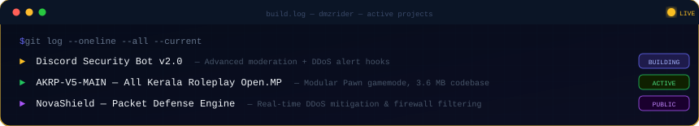
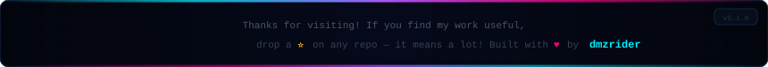

<!-- DYNAMIC BANNER -->

  

<!-- ⚡ TYPEWRITER WIDGET -->

  

 

<!-- 🟢 HUD STATUS BAR -->

  

 

<!-- 📊 LIVE COUNTERS & BADGES -->

  
  &nbsp;&nbsp;
  
  &nbsp;&nbsp;
  
  &nbsp;&nbsp;
  
  &nbsp;&nbsp;
  
  &nbsp;&nbsp;
  

 

---

<!-- ============================================================ -->

 

  

 

---

<!-- ============================================================ -->

 

  

 

---

<!-- ============================================================ -->

 

  

 

---

<!-- ============================================================ -->

 

  <table border="0" cellspacing="0" cellpadding="10">
    <tr>
      <td align="center" width="165"><b>🤖 Automation &amp; Bots</b></td>
      <td align="center" width="285">
        
      </td>
      <td width="370">Custom Discord bots, permission workflows, webhook piping, interactive buttons &amp; modals.</td>
    </tr>
    <tr>
      <td align="center"><b>🎮 Game Development</b></td>
      <td align="center">
        
      </td>
      <td>Modular gamemode scripting with y_less libs, MySQL threading, tick optimization, 3.6 MB codebase (AKRP-V5).</td>
    </tr>
    <tr>
      <td align="center"><b>🗄️ Database &amp; Infra</b></td>
      <td align="center">
        
      </td>
      <td>Database normalization, secure pipeline configs, localized hosting setups, and containerization.</td>
    </tr>
    <tr>
      <td align="center"><b>🛡️ Cloud &amp; Security</b></td>
      <td align="center">
        
      </td>
      <td>Network traffic shielding, DDoS alert automation via bash triggers, Cloudflare proxying.</td>
    </tr>
  </table>

 

---

<!-- ============================================================ -->

 

  

> 💡 *AKRP-V5-MAIN and MazhaV1 are in private repos — public releases coming soon!*

 

---

<!-- ============================================================ -->

 

  <table border="0">
    <tr>
      <td align="center" valign="top">
        
      </td>
      <td align="center" valign="top">
        
      </td>
    </tr>
  </table>

 

<!-- ⚡ REPOSITORY LANGUAGE TELEMETRY (auto-updated by workflow) -->

<!-- START_SECTION:languages -->
<svg xmlns="http://www.w3.org/2000/svg" viewBox="0 0 495 220" width="495">
  <defs>
    <linearGradient id="wkbg" x1="0%" y1="0%" x2="100%" y2="100%">
      <stop offset="0%" stop-color="#070a13"/>
      <stop offset="100%" stop-color="#0d1117"/>
    </linearGradient>
    <linearGradient id="barPawnSAMP" x1="0%" y1="0%" x2="100%" y2="0%">
      <stop offset="0%" stop-color="#3b82f6"/><stop offset="100%" stop-color="#60a5fa"/>
    </linearGradient>
    <linearGradient id="barJavaScript" x1="0%" y1="0%" x2="100%" y2="0%">
      <stop offset="0%" stop-color="#f7df1e"/><stop offset="100%" stop-color="#f1e05a"/>
    </linearGradient>
    <linearGradient id="barTypeScript" x1="0%" y1="0%" x2="100%" y2="0%">
      <stop offset="0%" stop-color="#3178c6"/><stop offset="100%" stop-color="#60a5fa"/>
    </linearGradient>
    <linearGradient id="barSQLMySQL" x1="0%" y1="0%" x2="100%" y2="0%">
      <stop offset="0%" stop-color="#00a3cc"/><stop offset="100%" stop-color="#00e5ff"/>
    </linearGradient>
    <linearGradient id="barPython" x1="0%" y1="0%" x2="100%" y2="0%">
      <stop offset="0%" stop-color="#3572A5"/><stop offset="100%" stop-color="#4584b6"/>
    </linearGradient>
    <filter id="wkGlow"><feGaussianBlur stdDeviation="2" result="b"/><feMerge><feMergeNode in="b"/><feMergeNode in="SourceGraphic"/></feMerge></filter>
  </defs>
  <rect width="495" height="220" rx="10" fill="url(#wkbg)" stroke="#1a233a" stroke-width="1.2"/>
  <rect width="495" height="220" rx="10" fill="none" stroke="#a855f7" stroke-width="1.2" opacity="0.3">
    <animate attributeName="opacity" values="0.2;0.6;0.2" dur="3s" repeatCount="indefinite"/>
  </rect>
  <text x="30" y="32" font-family="'Courier New',Courier,monospace" font-size="12" font-weight="bold" fill="#a855f7" letter-spacing="1">⚡ REPOSITORY LANGUAGE METRICS</text>
  <text x="465" y="31" font-family="'Courier New',Courier,monospace" font-size="9" fill="#64748b" text-anchor="end">Metrics: Dynamic Source</text>
  <g transform="translate(30, 48)">
    <text x="0" y="12" font-family="Arial,sans-serif" font-size="11" font-weight="bold" fill="#e2e8f0">Pawn (SA-MP)</text>
    <text x="100" y="12" font-family="'Courier New',Courier,monospace" font-size="10" fill="#3b82f6">3.6 MB</text>
    <rect x="160" y="3" width="220" height="9" rx="4.5" fill="#161b22"/>
    <rect x="160" y="3" width="0" height="9" rx="4.5" fill="url(#barPawnSAMP)">
      <animate attributeName="width" values="0;195;195" dur="1.5s" fill="freeze" begin="0.2s"/>
    </rect>
    <text x="390" y="11" font-family="'Courier New',Courier,monospace" font-size="10" fill="#3b82f6">89%</text>
  </g>
  <g transform="translate(30, 76)">
    <text x="0" y="12" font-family="Arial,sans-serif" font-size="11" font-weight="bold" fill="#e2e8f0">JavaScript</text>
    <text x="100" y="12" font-family="'Courier New',Courier,monospace" font-size="10" fill="#f7df1e">205 KB</text>
    <rect x="160" y="3" width="220" height="9" rx="4.5" fill="#161b22"/>
    <rect x="160" y="3" width="0" height="9" rx="4.5" fill="url(#barJavaScript)">
      <animate attributeName="width" values="0;11;11" dur="1.5s" fill="freeze" begin="0.4s"/>
    </rect>
    <text x="390" y="11" font-family="'Courier New',Courier,monospace" font-size="10" fill="#f7df1e">5%</text>
  </g>
  <g transform="translate(30, 104)">
    <text x="0" y="12" font-family="Arial,sans-serif" font-size="11" font-weight="bold" fill="#e2e8f0">TypeScript</text>
    <text x="100" y="12" font-family="'Courier New',Courier,monospace" font-size="10" fill="#3178c6">150 KB</text>
    <rect x="160" y="3" width="220" height="9" rx="4.5" fill="#161b22"/>
    <rect x="160" y="3" width="0" height="9" rx="4.5" fill="url(#barTypeScript)">
      <animate attributeName="width" values="0;8;8" dur="1.5s" fill="freeze" begin="0.6s"/>
    </rect>
    <text x="390" y="11" font-family="'Courier New',Courier,monospace" font-size="10" fill="#3178c6">4%</text>
  </g>
  <g transform="translate(30, 132)">
    <text x="0" y="12" font-family="Arial,sans-serif" font-size="11" font-weight="bold" fill="#e2e8f0">SQL/MySQL</text>
    <text x="100" y="12" font-family="'Courier New',Courier,monospace" font-size="10" fill="#00a3cc">80 KB</text>
    <rect x="160" y="3" width="220" height="9" rx="4.5" fill="#161b22"/>
    <rect x="160" y="3" width="0" height="9" rx="4.5" fill="url(#barSQLMySQL)">
      <animate attributeName="width" values="0;4;4" dur="1.5s" fill="freeze" begin="0.8s"/>
    </rect>
    <text x="390" y="11" font-family="'Courier New',Courier,monospace" font-size="10" fill="#00a3cc">2%</text>
  </g>
  <g transform="translate(30, 160)">
    <text x="0" y="12" font-family="Arial,sans-serif" font-size="11" font-weight="bold" fill="#e2e8f0">Python</text>
    <text x="100" y="12" font-family="'Courier New',Courier,monospace" font-size="10" fill="#3572A5">26 KB</text>
    <rect x="160" y="3" width="220" height="9" rx="4.5" fill="#161b22"/>
    <rect x="160" y="3" width="0" height="9" rx="4.5" fill="url(#barPython)">
      <animate attributeName="width" values="0;2;2" dur="1.5s" fill="freeze" begin="1.0s"/>
    </rect>
    <text x="390" y="11" font-family="'Courier New',Courier,monospace" font-size="10" fill="#3572A5">1%</text>
  </g>
</svg>
<!-- END_SECTION:languages -->

 

  

 

  

 

---

<!-- ============================================================ -->

 

  

 

  

 

---

<!-- ============================================================ -->

 

  <picture>
    <source media="(prefers-color-scheme: dark)" srcset="github-contribution-grid-snake-dark-v2.svg">
    <source media="(prefers-color-scheme: light)" srcset="github-contribution-grid-snake-v2.svg">
    
  </picture>

 

---

<!-- 💡 QUOTE & JOKE -->

  

 

  

 

---

<!-- ============================================================ -->

 

  

---

<!-- ============================================================ -->

 

  

 

---

<!-- ============================================================ -->

 

  

 

---

<!-- FOOTER -->

  

